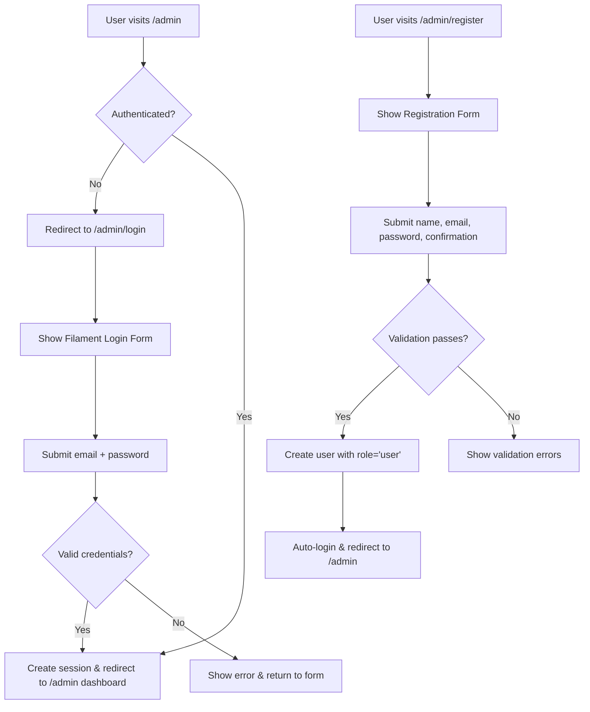
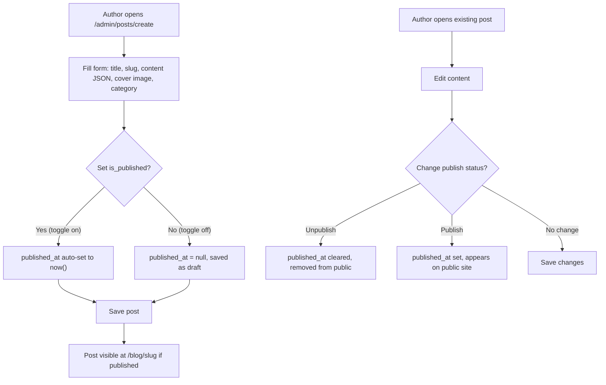
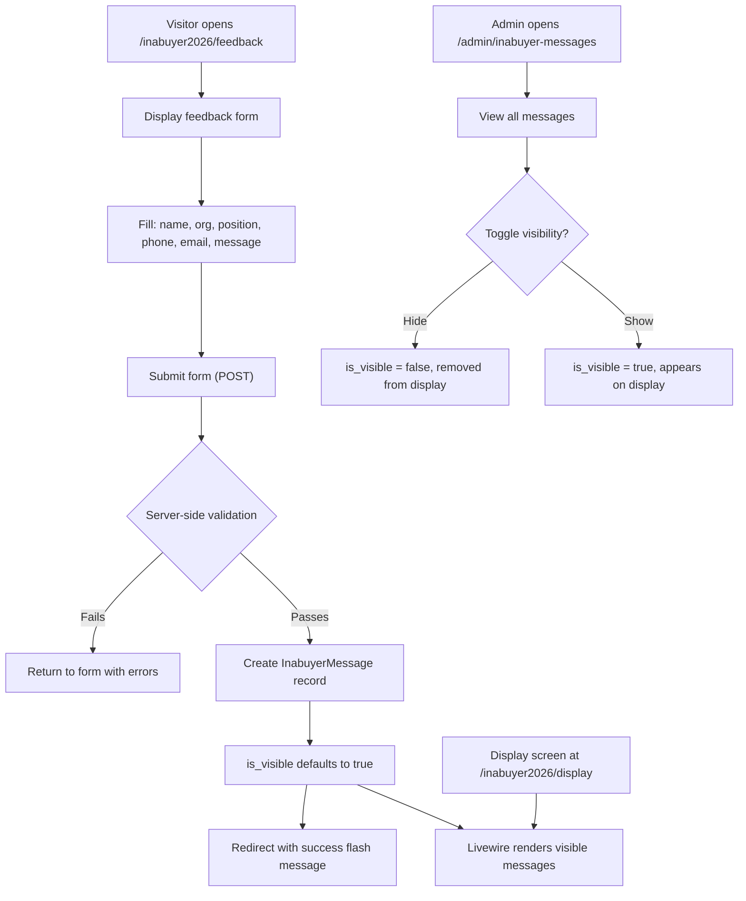
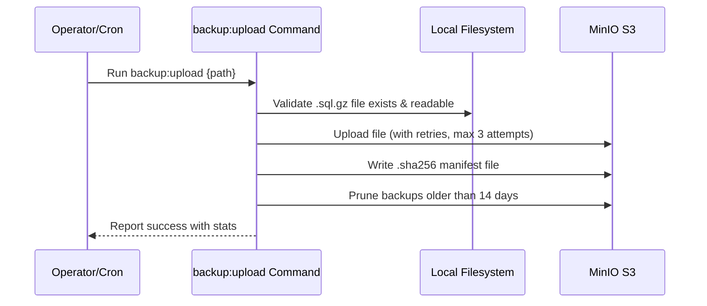
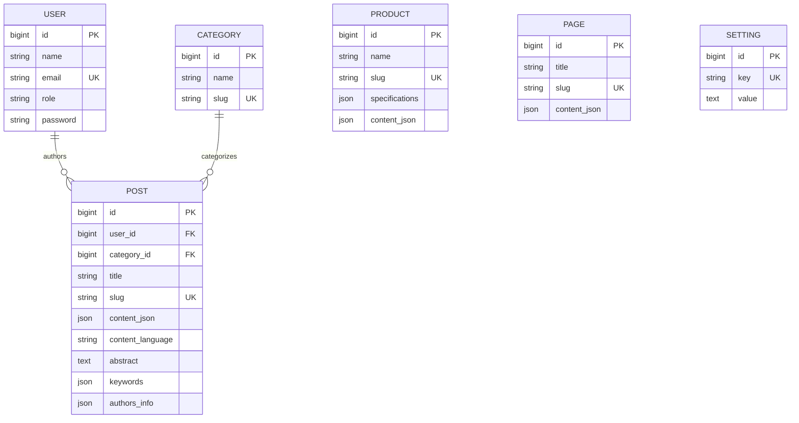
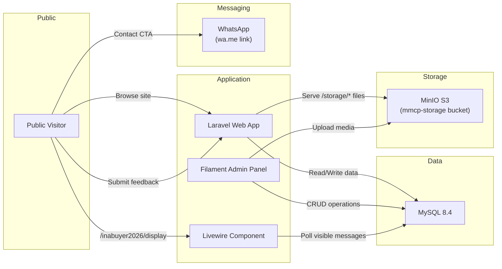

# Product Requirements Document (PRD)
# Madeena Company Profile

> **Last Updated**: 2026-06-12
> **Version**: 2.0 (Post WordPress-like & Academic CMS Upgrade)
> **Status**: Living Document

---

## 1. Product Overview

### 1.1 What is Madeena Company Profile?

**Madeena Company Profile** is the official corporate website for **PT Madeena Karya Indonesia**, an Indonesian manufacturer of Digital Direct Radiography (DDR) equipment based on Camera Coupled X-Ray Detector (CCXD) technology. The company was founded to commercialize medical imaging innovations developed at Universitas Gadjah Mada (UGM), and the website serves as the primary digital presence for the organization.

The application functions as both a **public-facing marketing website** and a **drag-and-drop WordPress-like CMS**. The public side showcases products, academic/research blog articles, legal certifications, and contact information. The admin side, powered by Filament v5, provides a powerful and elderly-friendly CMS. Key capabilities include:
- A drag-and-drop **Homepage Editor** and **Page Builder** for dynamic page construction.
- An **Academic-style Article Editor** supporting Elsevier/Nature-style typesetting (equations, figures, tables, reference cross-linking) for the research blog.
- Dynamic global site settings (SEO, branding, social links).
- A real-time Inabuyer 2026 Event Module.

### 1.2 Tech Stack Summary

| Layer | Technology | Version |
|---|---|---|
| Backend Framework | Laravel (PHP) | 13.x / PHP 8.4 |
| Admin Panel | Filament PHP | 5.x |
| Editor Engine | Tiptap (RichEditor) | Native to Filament v5 |
| Math Rendering | KaTeX | via npm |
| Frontend CSS | Tailwind CSS | 3.4 |
| Frontend JS | Alpine.js | 3.15 |
| Build Tool | Vite | 6.x |
| Database | MySQL | 8.4 |
| Production Server | Nginx + PHP 8.4-FPM | Alpine |
| Container | Docker (multi-stage) | — |
| Orchestration | Docker Swarm | — |
| Object Storage | MinIO (S3-compatible) | — |
| CI/CD | GitHub Actions (self-hosted runners) | 8 workflows |
| Testing | PHPUnit | 11.x |
| Code Formatting | Laravel Pint | 1.x |
| Real-time Components | Livewire | (bundled with Filament v5) |

### 1.3 Key URLs / Entry Points

| URL Pattern | Purpose | Auth Required |
|---|---|---|
| `/` | Homepage — dynamic sections driven by builder | No |
| `/produk/{slug}` | Individual product detail page (builder driven) | No |
| `/blog` | Blog listing (paginated) | No |
| `/blog/{slug}` | Individual blog/academic post | No |
| `/halaman/{slug}` | Custom static page (builder driven) | No |
| `/inabuyer2026/feedback` | Inabuyer 2026 event feedback form | No |
| `/inabuyer2026/display` | Inabuyer 2026 live message display (Livewire) | No |
| `/inabuyer2026/feedback/csrf-token` | CSRF token endpoint for the feedback form | No |
| `/storage/{path}` | Public file proxy (serves S3 assets) | No |
| `/health` | Application health check (DB connectivity) | No |
| `/admin` | Filament admin panel (login, custom dashboard, CMS) | Yes |
| `/admin/register` | Filament registration page (creates 'user' role) | No |

---

## 2. User Personas & Roles

### 2.1 Public Visitor
- **Description**: Anyone visiting the website — prospective customers, healthcare facility operators, regulatory stakeholders, or general public
- **Access Level**: Read-only access to all public pages; can submit feedback via the Inabuyer 2026 form
- **Key Workflows**: Browse homepage → view products → read academic articles → contact via WhatsApp; submit event feedback

### 2.2 Admin (role: `admin`)
- **Description**: System administrators and content managers (e.g., Prof. Gede Bayu Suparta).
- **Access Level**: Full access to all Filament resources — CRUD on all content types, user management, site settings, and Inabuyer message moderation.
- **Key Workflows**: Build the homepage via drag-and-drop, manage products via page builder, write academic articles, configure site settings, manage users.

### 2.3 User (role: `user`)
- **Description**: Authenticated panel users with limited permissions (e.g., blog contributors).
- **Access Level**: Can access the Filament panel and manage their own blog posts only.
- **Key Workflows**: Write and publish blog posts; edit/delete own posts only.

### 2.4 Access Control Matrix

| Feature / Resource | Admin | User | Public |
|---|---|---|---|
| Homepage & Public Pages | 👁️ | 👁️ | 👁️ |
| Product Detail Pages | 👁️ | 👁️ | 👁️ |
| Blog & Static Pages | 👁️ | 👁️ | 👁️ |
| Inabuyer 2026 Feedback Form | 👁️ ✍️ | 👁️ ✍️ | 👁️ ✍️ |
| Inabuyer 2026 Display | 👁️ | 👁️ | 👁️ |
| Filament Dashboard | ✅ | ✅ | ❌ |
| Homepage Editor | ✅ Edit | ❌ Hidden | ❌ |
| Product Management | ✅ CRUD | ❌ Hidden | ❌ |
| Blog Post Management | ✅ CRUD (all) | ✅ CRUD (own) | ❌ |
| Category Management | ✅ CRUD | ❌ Hidden | ❌ |
| Page Management | ✅ CRUD | ❌ Hidden | ❌ |
| Site Settings | ✅ Edit | ❌ Hidden | ❌ |
| User Management | ✅ CRUD | ❌ Hidden | ❌ |
| Inabuyer Message Moderation | ✅ Edit/Delete | ❌ Hidden | ❌ |

> **Legend**: ✅ = Full access, 👁️ = View only, ✍️ = Can submit, ❌ = No access

---

## 3. Feature Inventory

### 3.1 Public Website

#### F-001: Dynamic Homepage
- **Description**: Full-page landing built entirely via the Admin Homepage Editor. Renders dynamic sections (Hero, Products, About, Legalities, Contact, Video, Gallery, etc.) from JSON data.
- **User Roles**: Public
- **Routes**: `GET /`
- **Key Components**: `HomeController@index`, `home.blade.php`, `sections/` Blade partials.

#### F-002: Product Catalog & Detail
- **Description**: Individual product pages showing specifications and a dynamic rich-content body rendered from page builder JSON.
- **User Roles**: Public
- **Routes**: `GET /produk/{product:slug}`
- **Key Components**: `HomeController@product`, `product.blade.php`, `Product` model.

#### F-003: Blog & Academic Posts
- **Description**: Blog post pages with Elsevier/Nature-style formatting. Includes auto-numbered figures, tables, KaTeX equations, references, and cross-linking (`<x-academic-content>` component).
- **User Roles**: Public
- **Routes**: `GET /blog`, `GET /blog/{post:slug}`
- **Key Components**: `HomeController@blog`, `HomeController@post`, `blog.blade.php`, `post.blade.php`, `Post` model.

#### F-004: Static Pages
- **Description**: Dynamic frontend views (`GET /halaman/{slug}`) that render custom static pages constructed via the admin Page Builder.
- **User Roles**: Public
- **Routes**: `GET /halaman/{page:slug}`
- **Key Components**: `HomeController@page`, `page.blade.php`, `Page` model.

#### F-005: Public Storage Proxy
- **Description**: Serves files from MinIO S3 storage through a Laravel controller, providing a consistent `/storage/{path}` URL regardless of storage backend.
- **User Roles**: Public
- **Routes**: `GET /storage/{path}`
- **Key Components**: `PublicStorageController`, S3 `public` disk.

#### F-006: Health Check Endpoint
- **Description**: Simple JSON health check that verifies database connectivity.
- **User Roles**: Public / Infrastructure
- **Routes**: `GET /health`
- **Key Components**: Inline route closure.

---

### 3.2 Inabuyer 2026 Module

#### F-007: Event Feedback Form
- **Description**: Public form for event attendees to submit impressions and messages ("kesan dan pesan") during the Inabuyer 2026 exhibition.
- **User Roles**: Public
- **Routes**: `GET /inabuyer2026/feedback`, `POST /inabuyer2026/feedback`, `GET /inabuyer2026/feedback/csrf-token`
- **Key Components**: `Inabuyer2026\FeedbackController`, `inabuyer2026/feedback.blade.php`, `InabuyerMessage` model.

#### F-008: Live Message Display
- **Description**: Real-time Livewire component that displays visible event feedback messages for exhibition screens or projectors.
- **User Roles**: Public
- **Routes**: `GET /inabuyer2026/display`
- **Key Components**: `Inabuyer2026Display` Livewire component.

---

### 3.3 Admin Panel (Filament CMS)

#### F-009: Custom Dashboard
- **Description**: Simplified, elderly-friendly dashboard with quick action buttons (Tambah Produk, Tulis Artikel), website stats, and recent activity widget.
- **User Roles**: Admin, User
- **Routes**: `/admin`
- **Key Components**: `app/Filament/Pages/Dashboard.php`, custom Widgets.

#### F-010: Homepage Editor
- **Description**: A drag-and-drop page builder using Filament's Builder field. Allows admins to add, reorder, and configure homepage sections without coding. Hero banners are managed purely as JSON within this block.
- **User Roles**: Admin only
- **Routes**: `/admin/homepage-editor`
- **Key Components**: `app/Filament/Pages/HomepageEditor.php`

#### F-011: Academic Article Editor (Posts)
- **Description**: Post resource featuring an academic Tiptap RichEditor. Contains custom blocks for Figures, Tables, Equations, and References. Supports abstract, keywords, and author information fields.
- **User Roles**: Admin (all posts), User (own posts only)
- **Routes**: `/admin/posts`
- **Key Components**: `PostResource`, `Post` model, custom Tiptap blocks.

#### F-012: Category Management
- **Description**: Normalized taxonomy management for blog posts.
- **User Roles**: Admin only
- **Routes**: `/admin/categories`
- **Key Components**: `CategoryResource`, `Category` model.

#### F-013: Product & Page Management
- **Description**: Uses the same Filament Builder field as the homepage editor to allow complex, multi-section product detail pages and static pages.
- **User Roles**: Admin only
- **Routes**: `/admin/products`, `/admin/pages`
- **Key Components**: `ProductResource`, `PageResource`.

#### F-014: Site Settings
- **Description**: Global configuration for contact info, social media, SEO meta tags, custom navigation links, and dynamic branding (logo, primary/secondary colors, font family).
- **User Roles**: Admin only
- **Routes**: `/admin/site-settings`
- **Key Components**: `SiteSettings` page, `Setting` model.

#### F-015: User Management
- **Description**: CRUD management of admin panel users with role assignment. Dual role tracking was removed; it now relies purely on the `role` column.
- **User Roles**: Admin only
- **Routes**: `/admin/users`
- **Key Components**: `UserResource`, `User` model.

#### F-016: Inabuyer Message Moderation
- **Description**: Admin view for moderating event feedback messages, with visibility toggle.
- **User Roles**: Admin only
- **Routes**: `/admin/inabuyer-messages`
- **Key Components**: `InabuyerMessageResource`, `InabuyerMessage` model.

---

### 3.5 Application Flows

#### 3.5.1 Authentication Flow

#### 3.5.2 Content Publishing Flow (Blog Posts)

#### 3.5.3 Inabuyer 2026 Feedback Flow

#### 3.5.4 Database Backup Flow

---

## 4. Data Model

### 4.1 Database Schema

#### `users`
| Column | Type | Constraints | Description |
|---|---|---|---|
| `id` | bigint | PK, auto-increment | Primary key |
| `name` | varchar(255) | required | User's full name |
| `email` | varchar(255) | required, unique | Email address (login identifier) |
| `role` | varchar(255) | default: 'user' | Role identifier: 'admin' or 'user' |
| `password` | varchar(255) | required | Bcrypt-hashed password |

#### `categories`
| Column | Type | Constraints | Description |
|---|---|---|---|
| `id` | bigint | PK, auto-increment | Primary key |
| `name` | varchar(255) | required | Category name |
| `slug` | varchar(255) | required, unique | URL-friendly identifier |

#### `posts`
| Column | Type | Constraints | Description |
|---|---|---|---|
| `id` | bigint | PK, auto-increment | Primary key |
| `user_id` | bigint | FK → users.id | Author reference |
| `category_id` | bigint | FK → categories.id | Category reference |
| `title` | varchar(255) | required | Post title |
| `slug` | varchar(255) | required, unique | URL-friendly identifier |
| `content_json` | json | required | Tiptap Academic JSON content |
| `content_language`| varchar(10) | default 'id' | Locale for label rendering |
| `abstract` | text | nullable | Academic paper abstract |
| `keywords` | json | nullable | Array of keywords |
| `authors_info` | json | nullable | Additional authors metadata |
| `cover_image` | varchar(255) | nullable | S3 path to cover image |
| `is_published` | boolean | default: false | Publication status |
| `published_at` | timestamp | nullable | Publication date/time |

#### `products`
| Column | Type | Constraints | Description |
|---|---|---|---|
| `id` | bigint | PK, auto-increment | Primary key |
| `name` | varchar(255) | required | Product name |
| `slug` | varchar(255) | required, unique | URL-friendly identifier |
| `tagline` | varchar(255) | nullable | Product tagline |
| `specifications` | json | nullable | Key-value technical specifications |
| `content_json` | json | nullable | Page builder JSON content |
| `image_path` | varchar(255) | nullable | S3 path to product image |
| `is_active` | boolean | default: true | Active/inactive toggle |

#### `pages`
| Column | Type | Constraints | Description |
|---|---|---|---|
| `id` | bigint | PK, auto-increment | Primary key |
| `title` | varchar(255) | required | Page title |
| `slug` | varchar(255) | required, unique | URL-friendly identifier |
| `content_json` | json | required | Page builder JSON content |
| `content_language`| varchar(10) | default 'id' | Locale for label rendering |

#### `settings`
| Column | Type | Constraints | Description |
|---|---|---|---|
| `id` | bigint | PK, auto-increment | Primary key |
| `key` | varchar(255) | required, unique | Setting identifier |
| `value` | text | nullable | Setting value (can be JSON) |

*(Note: `inabuyer_messages`, framework tables, and logs remain as standard).*

### 4.2 ER Diagram

---

## 5. Integrations & External Services

### 5.1 MinIO S3-Compatible Object Storage
- **Purpose**: Primary storage backend for all uploaded media (product images, blog cover images, hero banners) and database backups.
- **Usage**: 
  - `public` disk: All Filament file uploads (banners, products, posts).
  - `enterprise_backups` disk: Database backup uploads via `backup:upload` command.
  - Files served to public via `PublicStorageController` at `/storage/{path}`.

### 5.2 KaTeX Integration
- **Purpose**: Render mathematical LaTeX equations on the frontend.
- **Usage**: Alpine.js script parses `[data-latex]` HTML nodes on Academic pages and processes them natively via the NPM katex package.

### 5.x Integration Architecture Diagram

---

## 6. Non-Functional Requirements

### 6.1 Performance
- **Caching**: File-based cache (`CACHE_STORE=file`). Settings are loaded via View Composer on every request with graceful fallback.
- **Optimization**: Production Dockerfile runs `php artisan optimize` (caches config, routes, views).
- **Asset Loading**: Academic CSS and KaTeX JS are only injected on post/page views requiring them.

### 6.2 Security
- **Authentication**: Session-based authentication via Filament. Bcrypt hashing.
- **Authorization**: Role-based access control (`role` = `admin` | `user`).
- **Data Protection**: CSRF protection, Path traversal protection on PublicStorageController, HTML sanitization on TableBlocks.

### 6.3 Deployment
- **Production Architecture**: Multi-stage Docker build (Composer deps → Node/Vite build → PHP base → App image).
- **Server**: Supervisor manages Nginx + PHP-FPM inside the container. Orchestrated via Docker Swarm.
- **CI/CD**: Fully deployed via GitHub Actions (`deploy-swarm.yml`, `tests.yml`).

---

## 7. Technical Debt Resolved in V2
- **Removed Dual Role Tracking**: The redundant `is_admin` column has been dropped in favor of the `role` column.
- **Normalized Categories**: Post categories are now stored in a dedicated `categories` table instead of free-text.
- **Routed Static Pages**: A frontend route (`GET /halaman/{slug}`) was added to render the newly created Page Builder content.
- **Removed Extraneous Tables**: `hero_banners` table was removed to embrace a pure JSON-driven builder approach.

---

## 8. Verification & Testing Requirements
The upgrade requires comprehensive testing:
- **Unit**: Test `Setting::getJson()`, `AcademicContentRenderer` (auto-numbering logic), cross-reference link generation.
- **Feature**: `HomepageEditorTest`, `AcademicArticleDisplayTest`, `ProductPageBuilderTest`, `SiteSettingsTest`, Dashboard widgets.
- **Migration**: Verify legacy HTML fields convert correctly to minimal Tiptap JSON.

---

## Appendix A. Environment Variables Reference

| Variable | Purpose | Required | Default |
|---|---|---|---|
| `APP_NAME` | Application name | Yes | `madeena_cp` |
| `APP_ENV` | Environment (local/production) | Yes | `local` |
| `APP_KEY` | Encryption key | Yes | — |
| `APP_DEBUG` | Debug mode toggle | Yes | `true` |
| `APP_URL` | Base URL | Yes | `http://localhost` |
| `DB_CONNECTION` | Database driver | Yes | `mysql` |
| `AWS_ACCESS_KEY_ID` | S3 Access Key | Yes (prod) | — |
| `AWS_SECRET_ACCESS_KEY` | S3 Secret Key | Yes (prod) | — |
| `AWS_BUCKET` | S3 Bucket Name | Yes | `mmcp-storage` |
| `AWS_ENDPOINT` | MinIO Endpoint | Yes | — |
