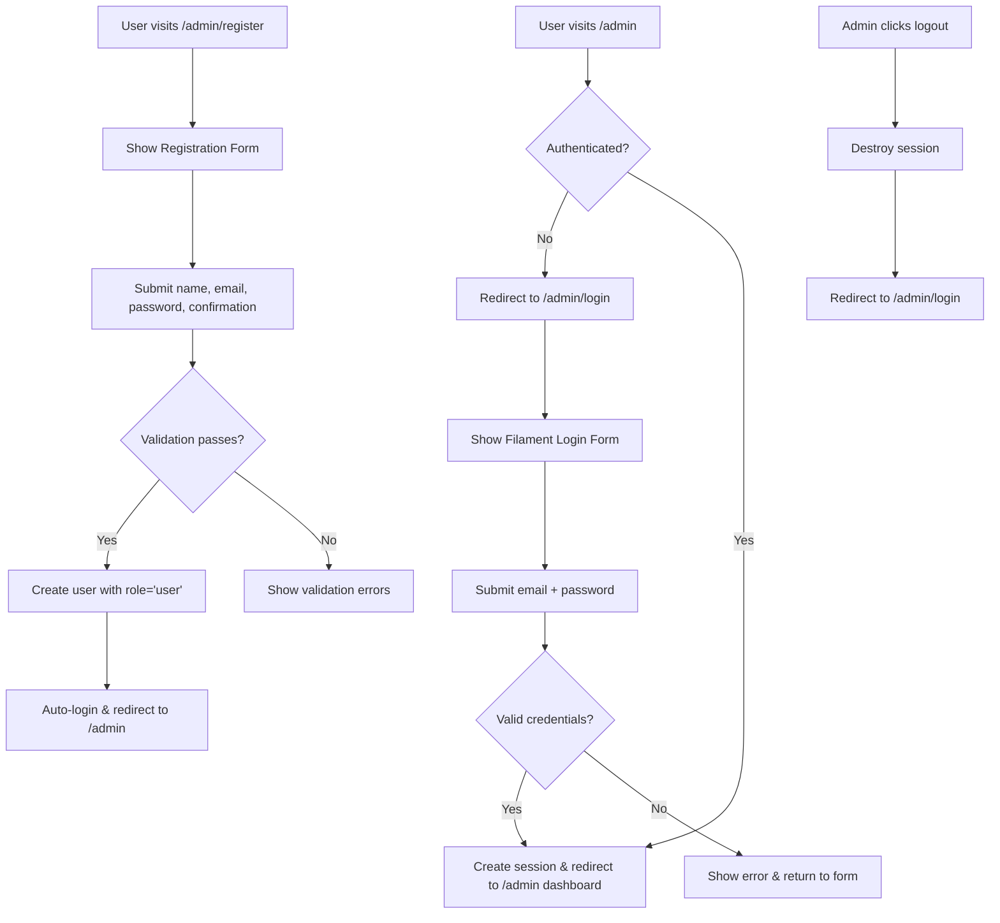
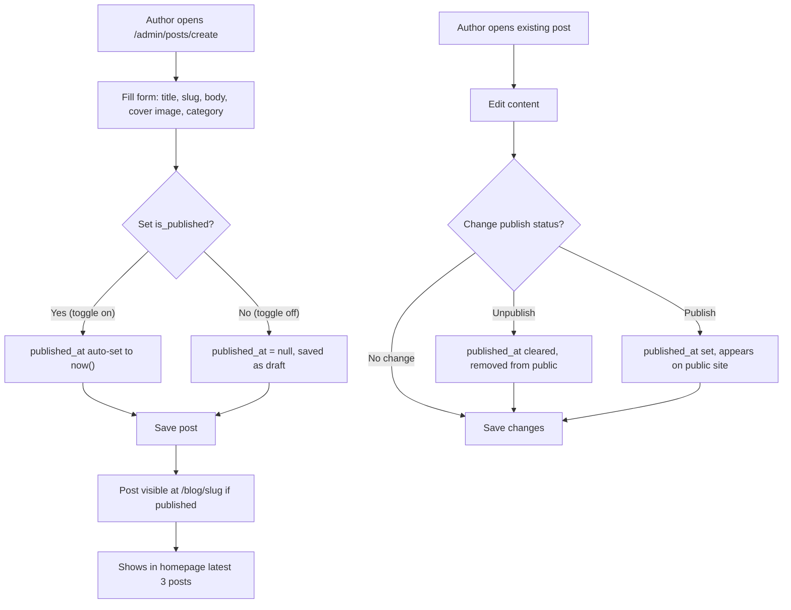
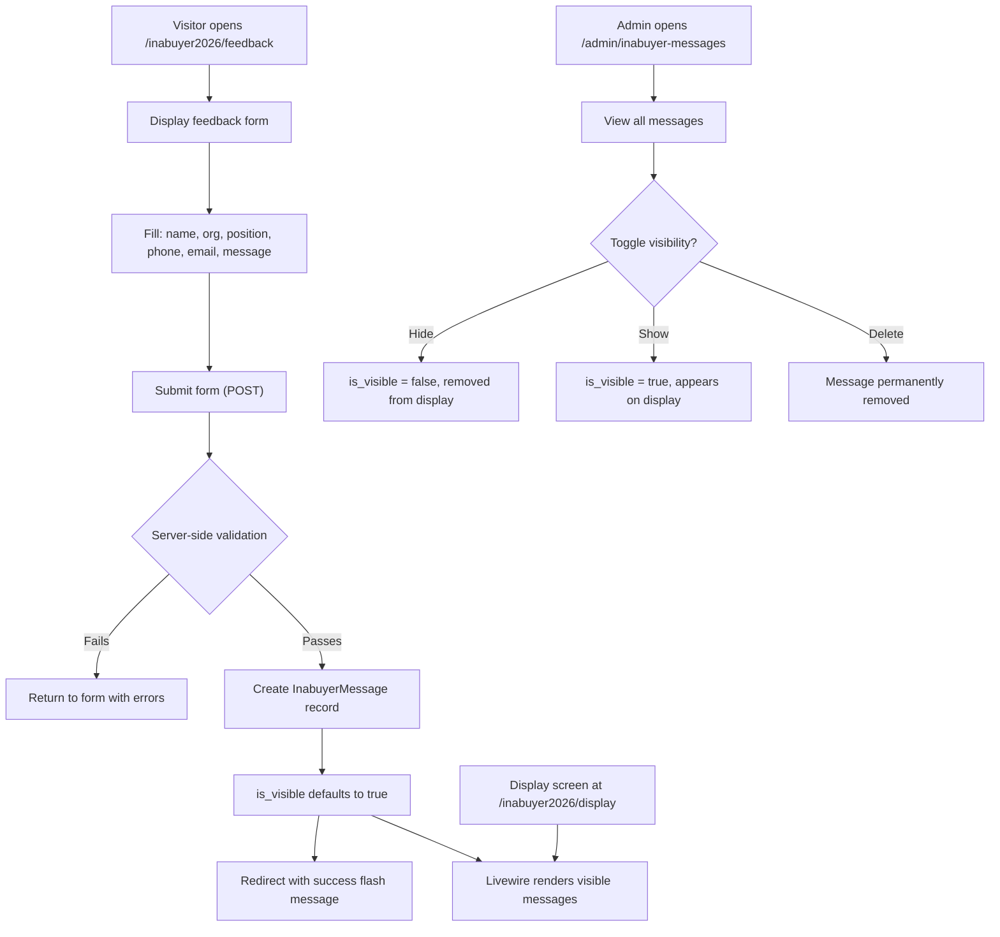
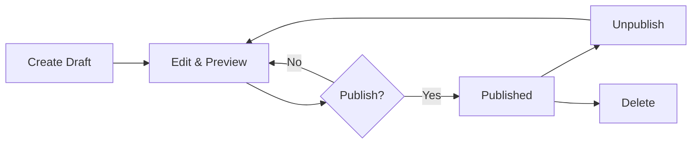
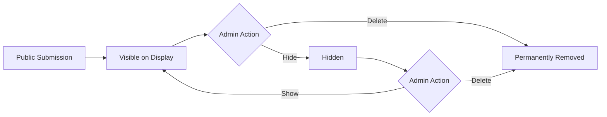
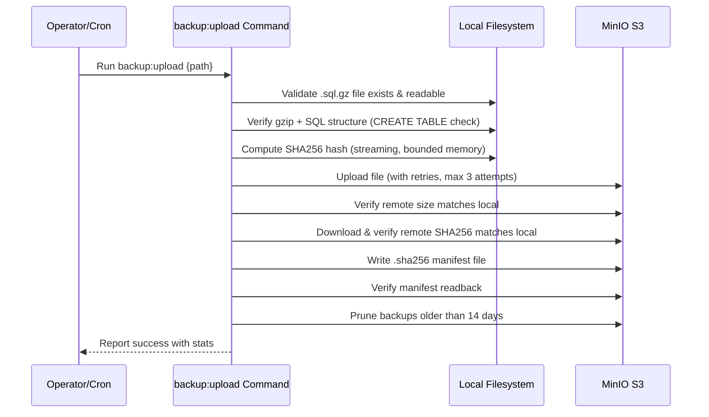
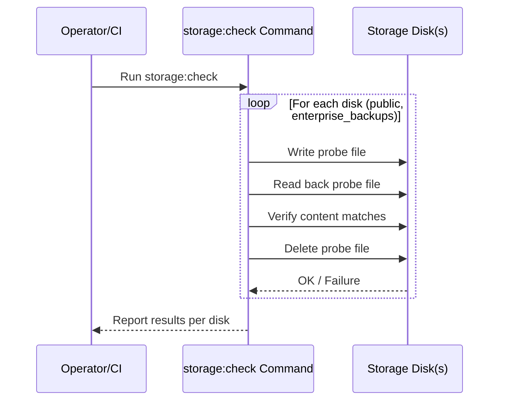
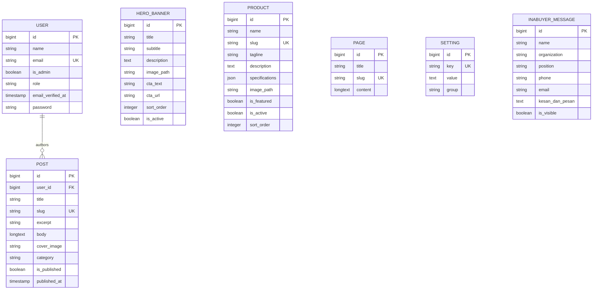
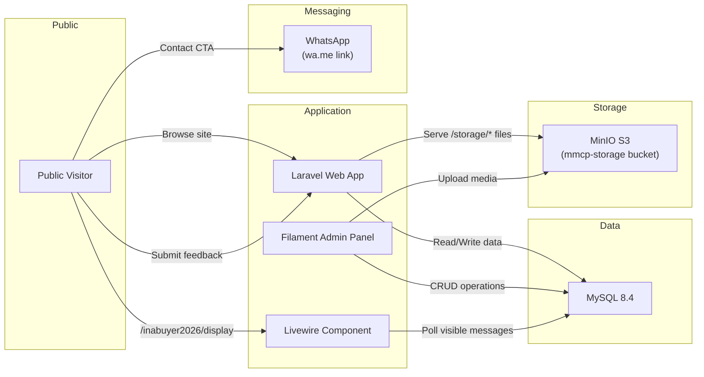

# Product Requirements Document (PRD)
# Madeena Company Profile

> **Last Updated**: 2026-06-10
> **Version**: 1.0
> **Status**: Living Document — Auto-generated from codebase analysis
> **Generated by**: AI Product Engineer

---

## 1. Product Overview

### 1.1 What is Madeena Company Profile?

**Madeena Company Profile** is the official corporate website for **PT Madeena Karya Indonesia**, an Indonesian manufacturer of Digital Direct Radiography (DDR) equipment based on Camera Coupled X-Ray Detector (CCXD) technology. The company was founded to commercialize medical imaging innovations developed at Universitas Gadjah Mada (UGM), and the website serves as the primary digital presence for the organization.

The application functions as both a **public-facing marketing website** and an **admin-managed content management system (CMS)**. The public side showcases the company's products, blog articles, research background, legal certifications, and contact information — with prominent WhatsApp integration for direct customer communication. The admin side, powered by Filament v5, provides a full CMS for managing hero banners, products, blog posts, static pages, site-wide settings, and user accounts.

A notable feature is the **Inabuyer 2026 Module** — a dedicated event feedback system with a public submission form and a real-time Livewire-powered display designed for exhibition/event use. The app's primary UI language is **Bahasa Indonesia**, reflecting its domestic market focus, while the admin panel labels are also in Indonesian.

### 1.2 Tech Stack Summary

| Layer | Technology | Version |
|---|---|---|
| Backend Framework | Laravel (PHP) | 13.x / PHP 8.4 |
| Admin Panel | Filament PHP | 5.x |
| Frontend CSS | Tailwind CSS | 3.4 |
| Frontend JS | Alpine.js | 3.15 |
| Build Tool | Vite | 6.x |
| Template Engine | Blade | (bundled with Laravel) |
| Database | MySQL | 8.4 |
| Dev Server | Artisan Serve | — |
| Production Server | Nginx + PHP 8.4-FPM | Alpine |
| Container | Docker (multi-stage) | — |
| Orchestration | Docker Swarm | — |
| Object Storage | MinIO (S3-compatible) | — |
| CI/CD | GitHub Actions (self-hosted runners) | 8 workflows |
| Testing | PHPUnit | 11.x |
| Code Formatting | Laravel Pint | 1.x |
| Real-time Components | Livewire | (bundled with Filament v5) |

### 1.3 Key URLs / Entry Points

| URL Pattern | Purpose | Auth Required |
|---|---|---|
| `/` | Homepage — hero banner, products, about, certifications, blog, contact | No |
| `/produk/{slug}` | Individual product detail page | No |
| `/blog` | Blog listing (paginated) | No |
| `/blog/{slug}` | Individual blog post | No |
| `/inabuyer2026/feedback` | Inabuyer 2026 event feedback form | No |
| `/inabuyer2026/display` | Inabuyer 2026 live message display (Livewire) | No |
| `/inabuyer2026/feedback/csrf-token` | CSRF token endpoint for the feedback form | No |
| `/storage/{path}` | Public file proxy (serves S3 assets) | No |
| `/health` | Application health check (DB connectivity) | No |
| `/admin` | Filament admin panel (login, dashboard, CMS) | Yes |
| `/admin/register` | Filament registration page (creates 'user' role) | No |

---

## 2. User Personas & Roles

### 2.1 Public Visitor
- **Description**: Anyone visiting the website — prospective customers, healthcare facility operators, regulatory stakeholders, or general public
- **Access Level**: Read-only access to all public pages; can submit feedback via the Inabuyer 2026 form
- **Key Workflows**: Browse homepage → view products → read blog → contact via WhatsApp; submit event feedback

### 2.2 Admin (role: `admin`)
- **Description**: System administrators and content managers at PT Madeena Karya Indonesia
- **Access Level**: Full access to all Filament resources — CRUD on all content types, user management, site settings, and Inabuyer message moderation
- **Key Workflows**: Manage hero banners, publish/edit products, write/publish blog posts, manage site settings (contact info, SEO, social links), moderate Inabuyer feedback messages, manage users

### 2.3 User (role: `user`)
- **Description**: Authenticated panel users with limited permissions (e.g., blog contributors)
- **Access Level**: Can access the Filament panel; can create and manage their own blog posts; cannot access hero banners, products, pages, settings, users, or Inabuyer messages
- **Key Workflows**: Write and publish blog posts; edit/delete own posts only

### 2.4 Access Control Matrix

| Feature / Resource | Admin | User | Public |
|---|---|---|---|
| Homepage & Public Pages | 👁️ | 👁️ | 👁️ |
| Product Detail Pages | 👁️ | 👁️ | 👁️ |
| Blog Pages | 👁️ | 👁️ | 👁️ |
| Inabuyer 2026 Feedback Form | 👁️ ✍️ | 👁️ ✍️ | 👁️ ✍️ |
| Inabuyer 2026 Display | 👁️ | 👁️ | 👁️ |
| Filament Dashboard | ✅ | ✅ | ❌ |
| Hero Banner Management | ✅ CRUD | ❌ Hidden | ❌ |
| Product Management | ✅ CRUD | ❌ Hidden | ❌ |
| Blog Post Management | ✅ CRUD (all) | ✅ CRUD (own) | ❌ |
| Page Management | ✅ CRUD | ❌ Hidden | ❌ |
| Site Settings | ✅ Edit | ❌ Hidden | ❌ |
| User Management | ✅ CRUD | ❌ Hidden | ❌ |
| Inabuyer Message Moderation | ✅ Edit/Delete | ❌ Hidden | ❌ |

> **Legend**: ✅ = Full access, 👁️ = View only, ✍️ = Can submit, ❌ = No access

---

## 3. Feature Inventory

### 3.1 Public Website

#### F-001: Homepage
- **Description**: Full-page landing with multiple sections: hero banner (CMS-driven), research & innovation overview, product showcase, company profile (visi/misi), legal certifications, latest blog posts, and contact information with WhatsApp CTA
- **User Roles**: Public
- **Routes**: `GET /`
- **Key Components**: `HomeController@index`, `home.blade.php`, `layouts/app.blade.php`
- **Business Rules**: Only active banners (`is_active = true`) are shown, sorted by `sort_order`. Only active products are shown. Only published posts (latest 3) are displayed. Smooth scroll navigation between sections.

#### F-002: Product Catalog & Detail
- **Description**: Individual product detail pages showing name, tagline, description (rich text), specifications (key-value pairs), and product image served from S3 storage
- **User Roles**: Public
- **Routes**: `GET /produk/{product:slug}`
- **Key Components**: `HomeController@product`, `product.blade.php`, `Product` model
- **Business Rules**: Inactive products (`is_active = false`) return 404. Products are resolved by slug via route model binding.

#### F-003: Blog Listing & Post Detail
- **Description**: Paginated blog listing and individual blog post pages with cover image, category badge, author info, publication date, and rich text body
- **User Roles**: Public
- **Routes**: `GET /blog`, `GET /blog/{post:slug}`
- **Key Components**: `HomeController@blog`, `HomeController@post`, `blog.blade.php`, `post.blade.php`, `Post` model
- **Business Rules**: Only published posts (`is_published = true`) are shown. Unpublished posts return 404. Posts resolved by slug. Blog listing paginated at 10 per page, ordered by `published_at` descending.

#### F-004: Public Storage Proxy
- **Description**: Serves files from MinIO S3 storage through a Laravel controller, providing a consistent `/storage/{path}` URL regardless of storage backend
- **User Roles**: Public
- **Routes**: `GET /storage/{path}`
- **Key Components**: `PublicStorageController`, S3 `public` disk
- **Business Rules**: Path traversal protection (`..` segments blocked). Null byte injection blocked. Returns streamed response from S3 with proper MIME type. 404 if file not found.

#### F-005: Health Check Endpoint
- **Description**: Simple JSON health check that verifies database connectivity
- **User Roles**: Public / Infrastructure
- **Routes**: `GET /health`
- **Key Components**: Inline route closure
- **Business Rules**: Returns `{"status": "ok", "db": "connected", "timestamp": "..."}` on success, 500 on database failure.

---

### 3.2 Inabuyer 2026 Module

#### F-006: Event Feedback Form
- **Description**: Public form for event attendees to submit impressions and messages ("kesan dan pesan") during the Inabuyer 2026 exhibition. Collects name, organization, position, phone, email, and message text.
- **User Roles**: Public
- **Routes**: `GET /inabuyer2026/feedback`, `POST /inabuyer2026/feedback`, `GET /inabuyer2026/feedback/csrf-token`
- **Key Components**: `Inabuyer2026\FeedbackController`, `inabuyer2026/feedback.blade.php`, `InabuyerMessage` model
- **Business Rules**: 
  - Name, organization, and message are required; position, phone, email are optional
  - CSRF protection with dedicated token endpoint (for potential AJAX usage)
  - Success message in Indonesian: "Terima kasih. Kesan dan pesan Anda telah kami terima."
  - Redirects back to form after submission
  - New messages default to `is_visible = true`

#### F-007: Live Message Display
- **Description**: Real-time Livewire component that displays visible event feedback messages for exhibition screens or projectors. Uses a dedicated minimal layout (`display.blade.php`) without the main site navigation.
- **User Roles**: Public (designed for event display screens)
- **Routes**: `GET /inabuyer2026/display`
- **Key Components**: `Inabuyer2026Display` Livewire component, `livewire/inabuyer2026-display.blade.php`, `layouts/display.blade.php`
- **Business Rules**: Only messages with `is_visible = true` are shown. Messages ordered by latest first. Livewire enables real-time updates without page refresh.

---

### 3.3 Admin Panel (Filament CMS)

#### F-008: Hero Banner Management
- **Description**: CRUD management of homepage hero banners with drag-and-drop reordering
- **User Roles**: Admin only
- **Routes**: Filament resource routes under `/admin/hero-banners`
- **Key Components**: `HeroBannerResource`, `HeroBanner` model
- **Business Rules**: Image uploads to S3 `public` disk in `banners/` directory. Reorderable by `sort_order`. Active/inactive toggle. Navigation hidden from non-admin users.

#### F-009: Product Management
- **Description**: CRUD management of DDR products with specifications, images, and feature flags
- **User Roles**: Admin only
- **Routes**: Filament resource routes under `/admin/products`
- **Key Components**: `ProductResource`, `Product` model
- **Business Rules**: Slug auto-generated from product name. Specifications stored as JSON key-value pairs. Image uploads to S3 `products/` directory. Featured and active flags. Navigation hidden from non-admin users.

#### F-010: Blog Post Management
- **Description**: Rich text blog editor with cover images, categories, publication scheduling, and author assignment
- **User Roles**: Admin (all posts), User (own posts only)
- **Routes**: Filament resource routes under `/admin/posts`
- **Key Components**: `PostResource`, `Post` model, `PostPolicy`
- **Business Rules**: 
  - Slug auto-generated from title
  - Author field defaults to current user; non-admins cannot change author
  - Publishing toggle auto-sets `published_at` timestamp
  - Non-admin users see only their own posts in the table
  - Admins can edit/delete all posts; users can only edit/delete their own
  - Cover images uploaded to S3 `posts/` directory

#### F-011: Static Page Management
- **Description**: Simple CMS for creating static content pages with rich text editor
- **User Roles**: Admin only
- **Routes**: Filament resource routes under `/admin/pages`
- **Key Components**: `PageResource`, `Page` model
- **Business Rules**: Slug auto-generated from title. Navigation hidden from non-admin users.

#### F-012: Site Settings Management
- **Description**: Global site configuration page for managing contact info, social media links, and SEO metadata
- **User Roles**: Admin only
- **Routes**: Filament page at `/admin/manage-settings`
- **Key Components**: `ManageSettings` page, `Setting` model
- **Business Rules**: Key-value storage pattern. Settings grouped into sections: Contact Info (company name, tagline, email, phone, WhatsApp, address), Social Media (Instagram, LinkedIn, YouTube URLs), SEO (meta title, meta description). Settings are shared to public views via a View Composer.

#### F-013: User Management
- **Description**: CRUD management of admin panel users with role assignment
- **User Roles**: Admin only
- **Routes**: Filament resource routes under `/admin/users`
- **Key Components**: `UserResource`, `User` model
- **Business Rules**: 
  - Two roles: `admin` and `user`
  - Role change auto-syncs `is_admin` boolean flag via model `saving` event
  - Password only required on creation; optional on update
  - Admins cannot delete their own account
  - Email must be unique
  - Navigation hidden from non-admin users

#### F-014: Inabuyer Message Moderation
- **Description**: Admin view for moderating event feedback messages, with visibility toggle
- **User Roles**: Admin only
- **Routes**: Filament resource routes under `/admin/inabuyer-messages`
- **Key Components**: `InabuyerMessageResource`, `InabuyerMessage` model
- **Business Rules**: 
  - No manual creation — messages come from the public feedback form only
  - Inline visibility toggle (eye icon) to show/hide messages on the display screen
  - Edit and delete capabilities
  - Bulk delete supported
  - Navigation hidden from non-admin users

#### F-015: User Registration (Filament)
- **Description**: Custom Filament registration page allowing new users to create accounts with the `user` role
- **User Roles**: Public
- **Routes**: `/admin/register`
- **Key Components**: `Filament/Pages/Auth/Register.php`
- **Business Rules**: New registrations always get `role = user` and `is_admin = false`. Form labels in Indonesian. Password minimum 8 characters with confirmation.

---

## 3.5 Application Flows

### 3.5.1 Authentication Flow

### 3.5.2 Core Business Flows

#### Content Publishing Flow (Blog Posts)

#### Inabuyer 2026 Feedback Flow

### 3.5.3 Data Lifecycle Flows

#### Blog Post Lifecycle

#### Inabuyer Message Lifecycle

### 3.5.4 Background & Async Flows

#### Database Backup Flow

#### Storage Health Check Flow

---

## 4. Data Model

### 4.1 Entity Relationship Overview

The application has a relatively flat data model centered around **content entities** managed by admin **users**. The core entities are:

- **User**: The only entity with authentication; manages blog posts via a foreign key relationship
- **Post**: Blog articles authored by users, the only entity with an explicit model relationship
- **Product**: Product catalog entries with JSON specifications — standalone, no relationships
- **HeroBanner**: Homepage hero section banners — standalone, sorted by order
- **Page**: Simple static content pages — standalone
- **Setting**: Key-value configuration store — standalone, queried by key
- **InabuyerMessage**: Event feedback entries — standalone, no foreign keys

The only explicit foreign key relationship is `Post → User` (author). All other entities are independent.

### 4.2 Database Schema

#### `users`
| Column | Type | Constraints | Description |
|---|---|---|---|
| `id` | bigint (unsigned) | PK, auto-increment | Primary key |
| `name` | varchar(255) | required | User's full name |
| `email` | varchar(255) | required, unique | Email address (login identifier) |
| `is_admin` | boolean | default: false | Legacy admin flag, auto-synced from `role` |
| `role` | varchar(255) | default: 'user' | Role identifier: 'admin' or 'user' |
| `email_verified_at` | timestamp | nullable | Email verification timestamp |
| `password` | varchar(255) | required | Bcrypt-hashed password |
| `remember_token` | varchar(100) | nullable | Session remember token |
| `created_at` | timestamp | nullable | — |
| `updated_at` | timestamp | nullable | — |

**Relationships**: `hasMany` → Posts (implicit via `user_id` FK on posts)

---

#### `hero_banners`
| Column | Type | Constraints | Description |
|---|---|---|---|
| `id` | bigint (unsigned) | PK, auto-increment | Primary key |
| `title` | varchar(255) | required | Banner headline |
| `subtitle` | varchar(255) | nullable | Banner subheadline |
| `description` | text | nullable | Banner body text |
| `image_path` | varchar(255) | nullable | S3 path to banner image |
| `cta_text` | varchar(255) | nullable | Call-to-action button label |
| `cta_url` | varchar(255) | nullable | Call-to-action button URL |
| `sort_order` | integer | default: 0 | Display order |
| `is_active` | boolean | default: true | Active/inactive toggle |
| `created_at` | timestamp | nullable | — |
| `updated_at` | timestamp | nullable | — |

**Relationships**: None

---

#### `products`
| Column | Type | Constraints | Description |
|---|---|---|---|
| `id` | bigint (unsigned) | PK, auto-increment | Primary key |
| `name` | varchar(255) | required | Product name |
| `slug` | varchar(255) | required, unique | URL-friendly identifier |
| `tagline` | varchar(255) | nullable | Product tagline |
| `description` | text | nullable | Rich text product description |
| `specifications` | json | nullable | Key-value technical specifications |
| `image_path` | varchar(255) | nullable | S3 path to product image |
| `is_featured` | boolean | default: false | Featured product flag |
| `is_active` | boolean | default: true | Active/inactive toggle |
| `sort_order` | integer | default: 0 | Display order |
| `created_at` | timestamp | nullable | — |
| `updated_at` | timestamp | nullable | — |

**Relationships**: None

---

#### `posts`
| Column | Type | Constraints | Description |
|---|---|---|---|
| `id` | bigint (unsigned) | PK, auto-increment | Primary key |
| `user_id` | bigint (unsigned) | nullable, FK → users.id (on delete: set null) | Author reference |
| `title` | varchar(255) | required | Post title |
| `slug` | varchar(255) | required, unique | URL-friendly identifier |
| `excerpt` | varchar(255) | nullable | Short summary/teaser |
| `body` | longtext | nullable | Rich text post content |
| `cover_image` | varchar(255) | nullable | S3 path to cover image |
| `category` | varchar(255) | nullable | Category label (free text) |
| `is_published` | boolean | default: false | Publication status |
| `published_at` | timestamp | nullable | Publication date/time |
| `created_at` | timestamp | nullable | — |
| `updated_at` | timestamp | nullable | — |

**Relationships**: `belongsTo` → User (as `author`)

---

#### `pages`
| Column | Type | Constraints | Description |
|---|---|---|---|
| `id` | bigint (unsigned) | PK, auto-increment | Primary key |
| `title` | varchar(255) | required | Page title |
| `slug` | varchar(255) | required, unique | URL-friendly identifier |
| `content` | longtext | nullable | Rich text page content |
| `created_at` | timestamp | nullable | — |
| `updated_at` | timestamp | nullable | — |

**Relationships**: None

---

#### `settings`
| Column | Type | Constraints | Description |
|---|---|---|---|
| `id` | bigint (unsigned) | PK, auto-increment | Primary key |
| `key` | varchar(255) | required, unique | Setting identifier |
| `value` | text | nullable | Setting value |
| `group` | varchar(255) | default: 'general' | Logical grouping |
| `created_at` | timestamp | nullable | — |
| `updated_at` | timestamp | nullable | — |

**Relationships**: None

---

#### `inabuyer_messages`
| Column | Type | Constraints | Description |
|---|---|---|---|
| `id` | bigint (unsigned) | PK, auto-increment | Primary key |
| `name` | varchar(255) | required | Submitter's name |
| `organization` | varchar(255) | nullable | Submitter's organization |
| `position` | varchar(255) | nullable | Submitter's job title |
| `phone` | varchar(50) | nullable | Contact phone number |
| `email` | varchar(255) | nullable | Contact email |
| `kesan_dan_pesan` | text | required | Impressions and message (Indonesian) |
| `is_visible` | boolean | default: true | Display visibility toggle |
| `created_at` | timestamp | nullable | — |
| `updated_at` | timestamp | nullable | — |

**Relationships**: None

---

#### Framework Tables

| Table | Purpose |
|---|---|
| `password_reset_tokens` | Password reset token storage |
| `sessions` | Database session storage |
| `cache` | Cache key-value store |
| `cache_locks` | Cache lock management |
| `jobs` | Queue job storage |
| `job_batches` | Queue batch tracking |
| `failed_jobs` | Failed job logging |

### 4.3 ER Diagram

---

## 5. Integrations & External Services

### 5.1 MinIO S3-Compatible Object Storage
- **Purpose**: Primary storage backend for all uploaded media (product images, blog cover images, hero banners) and database backups
- **Configuration**: `AWS_ACCESS_KEY_ID`, `AWS_SECRET_ACCESS_KEY`, `AWS_DEFAULT_REGION`, `AWS_BUCKET`, `AWS_ENDPOINT`, `AWS_USE_PATH_STYLE_ENDPOINT`
- **Usage**: 
  - `public` disk: All Filament file uploads (banners, products, posts)
  - `enterprise_backups` disk: Database backup uploads via `backup:upload` command
  - Files served to public via `PublicStorageController` at `/storage/{path}`

### 5.2 Mail (configured but not actively used)
- **Purpose**: Transactional email capability (currently set to `log` driver in development)
- **Configuration**: `MAIL_MAILER`, `MAIL_HOST`, `MAIL_PORT`, `MAIL_USERNAME`, `MAIL_PASSWORD`, `MAIL_FROM_ADDRESS`, `MAIL_FROM_NAME`
- **Usage**: Default Laravel mail configuration present; no custom mailables or notifications found in the codebase. The `User` model uses the `Notifiable` trait but no custom notifications exist.

### 5.3 Third-Party Service Configs (default, unused)
- **Purpose**: Laravel default service configuration stubs
- **Configuration**: `config/services.php` contains default entries for Postmark, SES, Resend, and Slack
- **Usage**: These are Laravel framework defaults and are **not actively used** in the application. No corresponding implementations were found in the codebase.

### 5.x Integration Architecture Diagram

---

## 6. Non-Functional Requirements

### 6.1 Performance
- **Caching**: File-based cache (`CACHE_STORE=file`). No explicit application-level caching of queries or views beyond Laravel's defaults.
- **Queue**: Synchronous in development (`QUEUE_CONNECTION=sync`), database-backed in production. No custom jobs currently dispatch to the queue.
- **Optimization**: 
  - Laravel Octane is a dependency (`laravel/octane ^2.17`) but the dev server uses standard `artisan serve`
  - Production Dockerfile runs `php artisan optimize` (caches config, routes, views)
  - Docker build uses multi-stage caching for Composer and npm dependencies
  - Settings are loaded via View Composer on every request with a graceful fallback if the `settings` table doesn't exist

### 6.2 Security
- **Authentication**: Session-based authentication via Filament's built-in auth system (login + registration). Bcrypt password hashing with 12 rounds.
- **Authorization**: 
  - Role-based access control via `role` column on `users` table (admin/user)
  - `PostPolicy` enforces per-resource permissions
  - Filament resources use `shouldRegisterNavigation()`, `canViewAny()`, `canCreate()`, `canEdit()`, `canDelete()` methods for access control
  - `FilamentUser` contract implemented on User model
- **Data Protection**: 
  - Passwords hashed via Laravel's `hashed` cast
  - CSRF protection on all forms
  - Path traversal protection on `PublicStorageController`
  - Null byte injection protection
- **CSRF**: Standard Laravel CSRF middleware + dedicated CSRF token endpoint for the Inabuyer feedback form

### 6.3 Deployment

#### Server Requirements
- PHP 8.4 with extensions: bcmath, curl, gd, intl, mbstring, opcache, pcntl, pdo_mysql, zip
- MySQL 8.4
- Nginx (production)
- Node.js 24.x (build only)
- Composer 2.x
- Docker (for containerized deployment)

#### Production Architecture
- **Multi-stage Docker build** (4 stages): Composer deps → Node/Vite build → PHP extensions base → Application image
- **Supervisor** manages Nginx + PHP-FPM inside the container
- **Docker Swarm** for orchestration with `docker-compose.prod.yml`
- **Health check**: PHP socket check on port 9000 (FPM) with 150s start period
- **Entrypoint script** handles migrations, seeding, and cache warming on container start

#### CI/CD Workflows (GitHub Actions, self-hosted runners)

| Workflow | Trigger | Purpose |
|---|---|---|
| `deploy-swarm.yml` | Manual (`workflow_dispatch`) | Full production deployment: build image → deploy via Docker Swarm |
| `tests.yml` | Manual (`workflow_dispatch`) | Run PHPUnit tests with parity guard (PHP 8.4, Laravel 13, Filament v5) |
| `server-setup-db.yml` | Manual | Set up production database server |
| `server-setup-deploy.yml` | Manual | Set up production deployment environment |
| `server-admin-reset.yml` | Manual | Reset server admin configuration |
| `issues.yml` | Issue events | Issue management automation |
| `pull-requests.yml` | PR events | PR management automation |
| `update-changelog.yml` | — | Changelog generation |

#### Environment Variables (grouped)

See **Appendix A** for the complete reference.

---

## 7. Current Limitations & Technical Debt

### 7.1 Stale `.env.example` Reference
- The `.env.example` file still references `OCTANE_SERVER=frankenphp` despite FrankenPHP being removed from the project. This should be cleaned up to avoid confusion.

### 7.2 No Role-Permission Package
- Access control is implemented via manual `isAdmin()` checks scattered across Filament resources rather than using a dedicated role-permission package (e.g., Spatie Permission, Filament Shield). This approach works for the current two-role system but will become difficult to maintain if more granular permissions are needed.

### 7.3 Limited Test Coverage
- The test suite has 7 test files (5 Feature, 1 Unit + ExampleTest), focused on storage configuration, the Inabuyer module, and the storage proxy route. There are no tests for:
  - HomeController and public page rendering
  - Filament admin CRUD operations
  - PostPolicy authorization logic
  - User registration flow
  - Settings management

### 7.4 No API Layer
- There is no `routes/api.php` and no REST/GraphQL API. All interactions are web-based. If mobile apps or third-party integrations are needed, an API layer would need to be built from scratch.

### 7.5 Free-Text Categories on Posts
- Blog post categories are stored as free-text strings rather than a normalized `categories` table. This makes filtering and consistency management difficult.

### 7.6 Pages Not Routed
- The `Page` model and Filament resource exist for managing static pages, but there is no public route to display them (e.g., `GET /page/{slug}`). The pages exist only in the admin panel.

### 7.7 Settings Loaded on Every Request
- The `AppServiceProvider` loads all settings from the database on every request via a View Composer. While there's a graceful fallback, this adds a database query per request that could be cached.

### 7.8 Dual Role Tracking
- Both `role` (string) and `is_admin` (boolean) columns exist on users, with a model event keeping them in sync. This redundancy adds complexity. The `is_admin` column is a legacy field that could be deprecated in favor of the `role` column only.

### 7.9 No Soft Deletes
- None of the models implement soft deletes. Deleted content (posts, products, messages) is permanently removed with no recovery option.

### 7.10 No Zero-TODO Codebase
- No TODO, FIXME, or HACK comments were found in the codebase — this is a positive finding.

---

## 8. Future Considerations

### 8.1 Evidence-Based (from code structure)
- **Page routing**: The `Page` model is fully scaffolded but lacks a public route — adding `GET /page/{slug}` would make the CMS pages feature complete
- **Email notifications**: The `User` model uses the `Notifiable` trait and mail configuration exists, suggesting email functionality is planned but not yet implemented
- **Queue workers**: The database queue driver is configured for production and the dev script includes `queue:listen`, suggesting background job processing is planned
- **API development**: The framework conventions and model structure are API-ready; adding `routes/api.php` with API resources would be straightforward

### 8.2 Architectural Suggestions
- **Multi-language support (i18n)**: Given the company's vision of becoming a "Duta Teknologi Indonesia" for global markets, adding multi-language support (Indonesian + English at minimum) would extend the website's reach
- **SEO enhancements**: Adding structured data (JSON-LD), Open Graph meta tags, and XML sitemap generation would improve search engine visibility for the product and blog pages
- **Analytics integration**: Adding Google Analytics, Plausible, or similar web analytics to track visitor behavior and conversion on WhatsApp CTAs
- **Image optimization pipeline**: Implementing automatic image resizing, WebP conversion, and CDN caching for S3-served media assets
- **Blog search and filtering**: Adding search functionality and category-based filtering to the blog listing page
- **Contact form**: Adding a direct contact form (with email notification) alongside the existing WhatsApp CTA
- **Product categories**: Normalizing product categorization as the product catalog grows
- **Cache layer**: Implementing Redis caching for settings, product listings, and published posts to reduce database load
- **Audit logging**: Adding activity logging for admin actions (content changes, user management) for accountability

---

## Appendix

### A. Environment Variables Reference

| Variable | Purpose | Required | Default |
|---|---|---|---|
| `APP_NAME` | Application name | Yes | `madeena_cp` |
| `APP_ENV` | Environment (local/production) | Yes | `local` |
| `APP_KEY` | Encryption key | Yes | — |
| `APP_DEBUG` | Debug mode toggle | Yes | `true` |
| `APP_TIMEZONE` | Application timezone | No | `Asia/Jakarta` |
| `APP_URL` | Base URL | Yes | `http://localhost:8000` |
| `APP_LOCALE` | Default locale | No | `en` |
| `DB_CONNECTION` | Database driver | Yes | `mysql` |
| `DB_HOST` | Database host | Yes | `127.0.0.1` |
| `DB_PORT` | Database port | Yes | `3306` |
| `DB_DATABASE` | Database name | Yes | `madeena_cp` |
| `DB_USERNAME` | Database user | Yes | `madeena_cp` |
| `DB_PASSWORD` | Database password | Yes | — |
| `SESSION_DRIVER` | Session storage driver | No | `database` |
| `QUEUE_CONNECTION` | Queue driver | No | `sync` |
| `CACHE_STORE` | Cache driver | No | `file` |
| `FILESYSTEM_DISK` | Default filesystem disk | No | `local` |
| `AWS_ACCESS_KEY_ID` | S3/MinIO access key | Yes | — |
| `AWS_SECRET_ACCESS_KEY` | S3/MinIO secret key | Yes | — |
| `AWS_DEFAULT_REGION` | S3 region | No | `us-east-1` |
| `AWS_BUCKET` | S3 bucket name | Yes | `mmcp-storage` |
| `AWS_ENDPOINT` | S3/MinIO endpoint URL | Yes | `http://127.0.0.1:9000` |
| `AWS_USE_PATH_STYLE_ENDPOINT` | Use path-style S3 URLs | No | `true` |
| `MAIL_MAILER` | Mail driver | No | `log` |
| `MAIL_HOST` | SMTP host | No | `127.0.0.1` |
| `MAIL_PORT` | SMTP port | No | `2525` |
| `MAIL_FROM_ADDRESS` | Sender email | No | `hello@example.com` |
| `FILAMENT_ADMIN_EMAIL` | Default admin email (seeder) | No | `admin@madeena.local` |
| `FILAMENT_ADMIN_PASSWORD` | Default admin password (seeder) | No | `root` |
| `BCRYPT_ROUNDS` | Password hashing rounds | No | `12` |
| `APP_STORAGE_HOST_PATH` | Docker host storage mount | No | `/var/lib/madeena_cp/storage` |
| `APP_LOGS_HOST_PATH` | Docker host logs mount | No | `/var/lib/madeena_cp/logs` |
| `MYSQL_DATA_HOST_PATH` | Docker host MySQL data mount | No | `/var/lib/madeena_cp/mysql` |

### B. Artisan Commands

| Command | Purpose | Schedule |
|---|---|---|
| `storage:check` | Write/read/verify/delete probe file on S3 disks to verify connectivity | Manual / CI |
| `backup:upload {path}` | Upload verified gzip SQL backup to S3 with integrity checks and retention | Manual / Cron |
| `madeena:seed-cms` | Seed CMS content only if tables are empty (idempotent) | Manual / Entrypoint |

### C. Seeder Data Reference

| Seeder | Purpose | Records |
|---|---|---|
| `AdminUserSeeder` | Creates/updates default super admin user | 1 user |
| `SettingSeeder` | Populates site settings (contact, social, SEO) | 11 settings |
| `HeroBannerSeeder` | Sample homepage banner | 1 banner |
| `ProductSeeder` | Sample DDR product entries | Multiple |
| `PostSeeder` | Sample blog posts | Multiple |
| `PageSeeder` | Sample static pages | Multiple |
