# 📖 Panduan Lengkap CMS Website Madeena

---

## 📋 Daftar Isi

1. Ringkasan Cepat (Cheat Sheet)
2. Masuk ke CMS (Login)
3. Mengenal Beranda (Dashboard)
4. Mengelola Halaman Utama Website (Homepage)
5. Mengelola Produk Inovasi
6. Menulis & Mengelola Artikel
7. Mengelola Halaman Website
8. Manajemen Pengguna (Admin)
9. Pengaturan Website
10. Tanya Jawab & Pemecahan Masalah (FAQ)

---

## 1. Ringkasan Cepat (Cheat Sheet)

| Saya ingin... | Langkah singkat |
|---|---|
| **Mengedit halaman depan** | Klik 🏠 **Halaman Utama** > Edit blok yang diinginkan > **Simpan Draft** > **Update Prod** |
| **Menambah produk baru** | Klik 📦 **Produk** > Klik **Buat Baru** > Isi data produk > **Simpan** |
| **Menulis artikel/berita** | Klik 📝 **Artikel** > Klik **Buat Baru** > Tulis di *Konten Artikel* > **Simpan** |
| **Membuat halaman profil/lain** | Klik 📄 **Halaman** > Klik **Buat Baru** > Susun blok halaman > **Simpan** |
| **Mengubah nomor WhatsApp/Alamat** | Klik ⚙️ **Pengaturan** > Ubah di bagian *Informasi Kontak* > **Simpan** |

---

## 2. Masuk ke CMS (Login)

CMS (*Content Management System*) adalah "ruang kontrol" website Anda. Dari sini Anda bisa mengubah isi website tanpa harus mengerti pemrograman.

**Langkah 1**: Buka *browser* (Google Chrome atau Mozilla Firefox) di komputer Anda.
**Langkah 2**: Ketikkan alamat website Anda di bagian atas, ditambahkan dengan `/admin` (contoh: `madeena.co.id/admin`).
**Langkah 3**: Masukkan email dan kata sandi (*password*) Anda, kemudian klik tombol **Masuk** (*Sign In*).

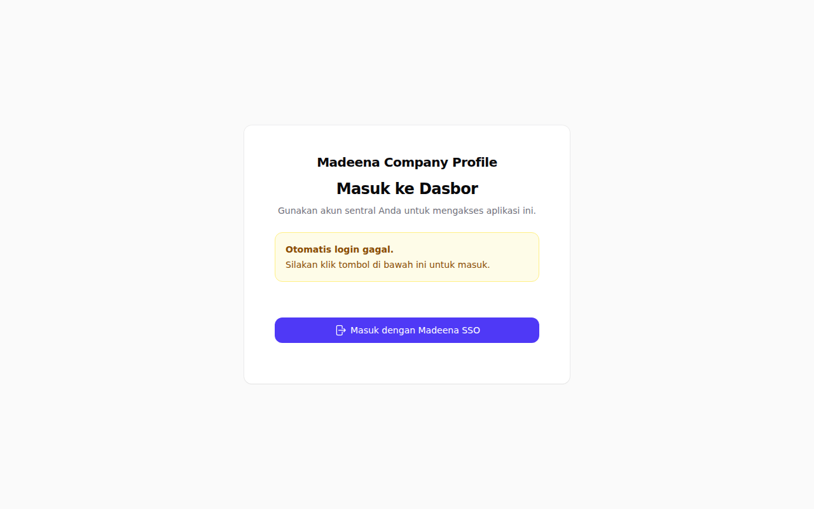
*Gambar 1: Tampilan awal halaman login untuk mengakses CMS.*

---

## 3. Mengenal Beranda (Dashboard)

Setelah berhasil masuk, Anda akan melihat **Beranda** (*Dashboard*). Ini adalah halaman utama panel admin.

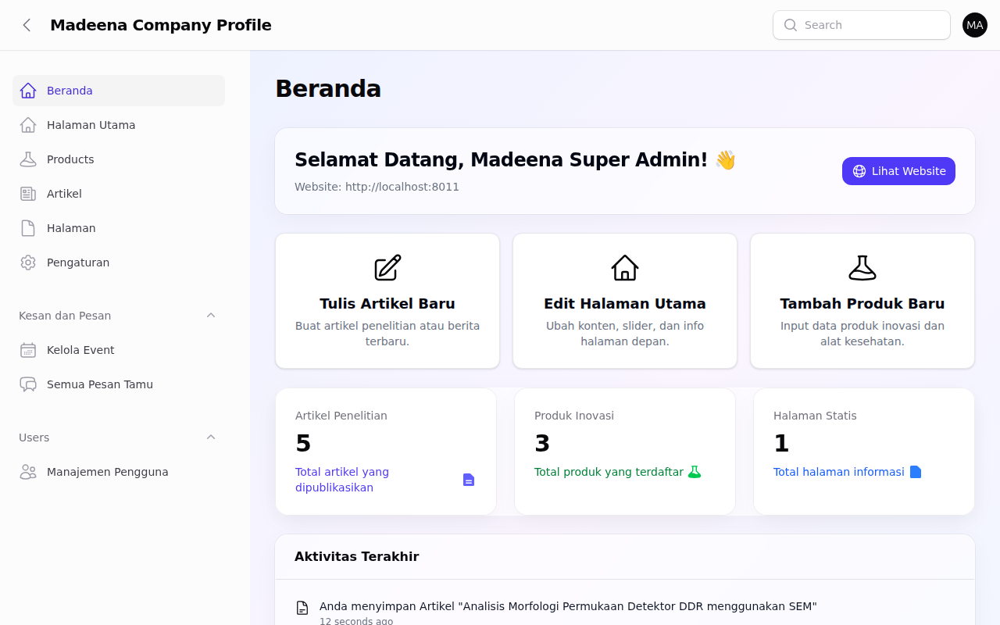
*Gambar 2: Tampilan Beranda (Dashboard) CMS Madeena.*

### Menu Utama di Sebelah Kiri (*Sidebar*):

- 🏠 **Halaman Utama** → Untuk mengubah tampilan dan teks di halaman depan website.
- 📦 **Produk** → Untuk mengelola daftar produk DDR dan inovasi kesehatan lainnya.
- 📝 **Artikel** → Untuk mengelola jurnal, publikasi, atau berita terbaru.
- 📄 **Halaman** → Untuk membuat halaman kustom (misal: halaman tentang sejarah spesifik).
- ⚙️ **Pengaturan** → Untuk mengatur informasi kontak, media sosial, logo, dan tulisan di pencarian Google.
- 👥 **Manajemen Pengguna** → Untuk menambah atau menghapus admin lain.

Sekarang Anda sudah mengenal Beranda (*Dashboard*). Mari kita mulai dengan hal yang paling penting: **mengelola tampilan halaman utama website Anda**. Klik menu 🏠 **Halaman Utama** di sebelah kiri.

---

## 4. Mengelola Halaman Utama Website (Homepage)

Halaman utama adalah hal pertama yang dilihat oleh pengunjung website. Anda bisa mengubah urutan, teks, dan gambar pada halaman ini.

**Langkah 1**: Klik menu 🏠 **Halaman Utama** di panel sebelah kiri.

*Gambar 3: Daftar "blok" yang menyusun halaman utama website.*

**Langkah 2**: Untuk mengedit suatu bagian (misal: *Hero Banner* atau *Produk*), klik tanda panah ke bawah (🔽) di sebelah kanan baris tersebut untuk membukanya.

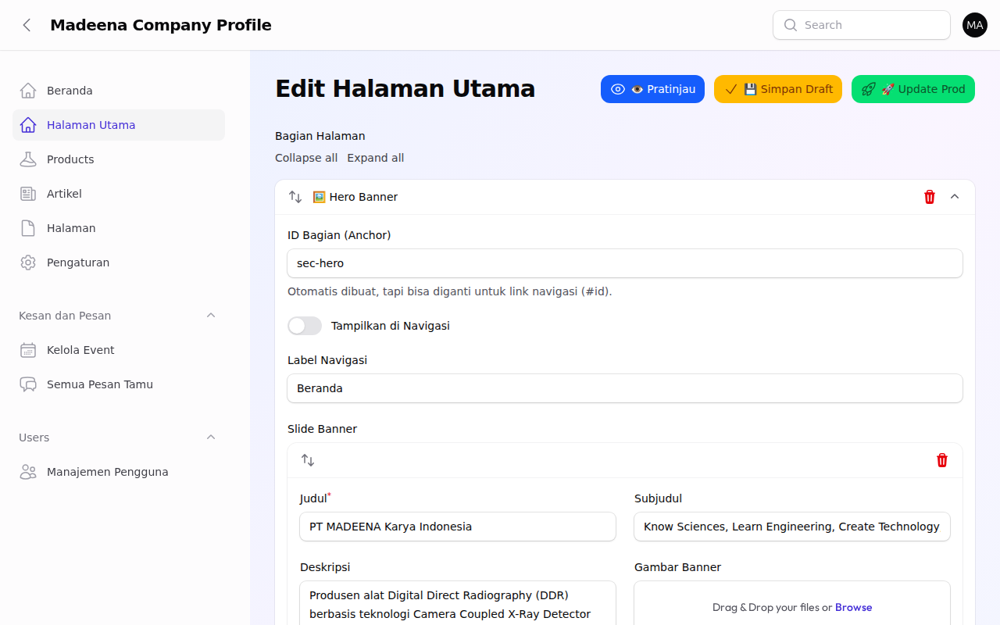
*Gambar 4: Tampilan detail setelah suatu blok dibuka. Anda bisa mengubah teks dan gambar di sini.*

**Langkah 3**: Ubah teks atau unggah gambar yang baru.
**Langkah 4**: Klik tombol **👁️ Pratinjau** di pojok kanan atas untuk melihat bagaimana hasilnya sebelum ditampilkan ke publik.
**Langkah 5**: Jika sudah sesuai, klik tombol kuning **💾 Simpan Draft** (disimpan untuk diedit nanti) atau tombol hijau **🚀 Update Prod** untuk langsung menerapkannya di website yang bisa diakses publik.

> ⚠️ **Perhatian**: Jangan lupa klik **Update Prod** jika Anda ingin perubahan tersebut langsung bisa dilihat oleh semua pengunjung website!

---

## 5. Mengelola Produk Inovasi

Menu ini digunakan untuk menampilkan produk-produk seperti sistem *Digital Direct Radiography* (DDR).

**Langkah 1**: Klik menu 📦 **Produk** di sebelah kiri. Anda akan melihat daftar semua produk.

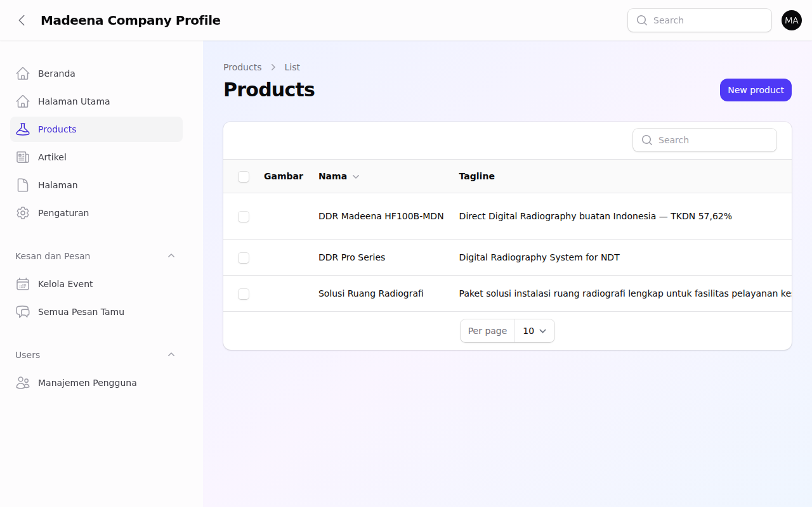
*Gambar 5: Daftar produk yang sudah Anda masukkan.*

**Langkah 2**: Untuk menambah produk baru, klik tombol **Buat Baru** (*Create*) di pojok kanan atas. Untuk mengedit produk yang sudah ada, klik ikon pensil (✏️).

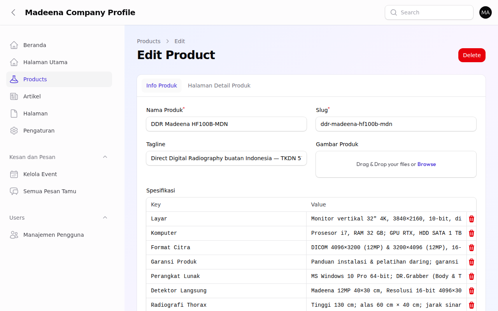
*Gambar 6: Formulir pengisian data produk.*

**Langkah 3**: Isi **Nama Produk** (contoh: *DDR Pro Series*).
**Langkah 4**: Isi **Spesifikasi**. Ini adalah tabel. Anda bisa menambah baris baru untuk resolusi, tegangan operasi, dll.
**Langkah 5**: Unggah **Gambar Produk** dengan mengklik area yang disediakan.
**Langkah 6**: Pindah ke *tab* (tab menu di bagian atas) **Halaman Detail Produk** untuk menyusun informasi detail menggunakan sistem blok.
**Langkah 7**: Klik tombol **Simpan** (*Save*) di bagian bawah.

---

## 6. Menulis & Mengelola Artikel

Menu ini digunakan untuk publikasi penelitian, berita, atau pengumuman.

**Langkah 1**: Klik menu 📝 **Artikel** di panel sebelah kiri.

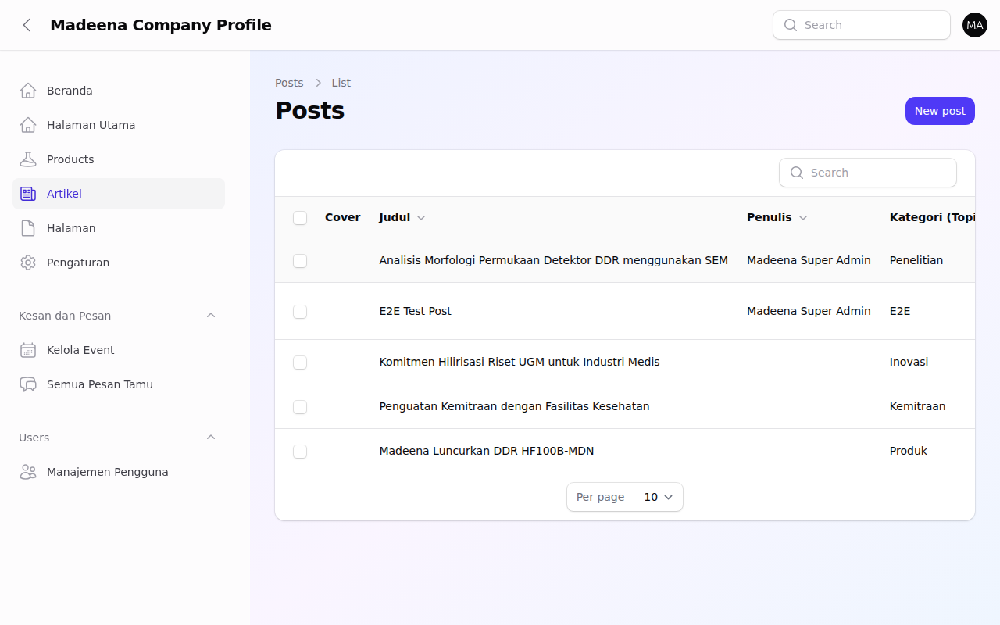
*Gambar 7: Daftar artikel dan penelitian yang telah dibuat.*

**Langkah 2**: Klik **Buat Baru** (*Create*).

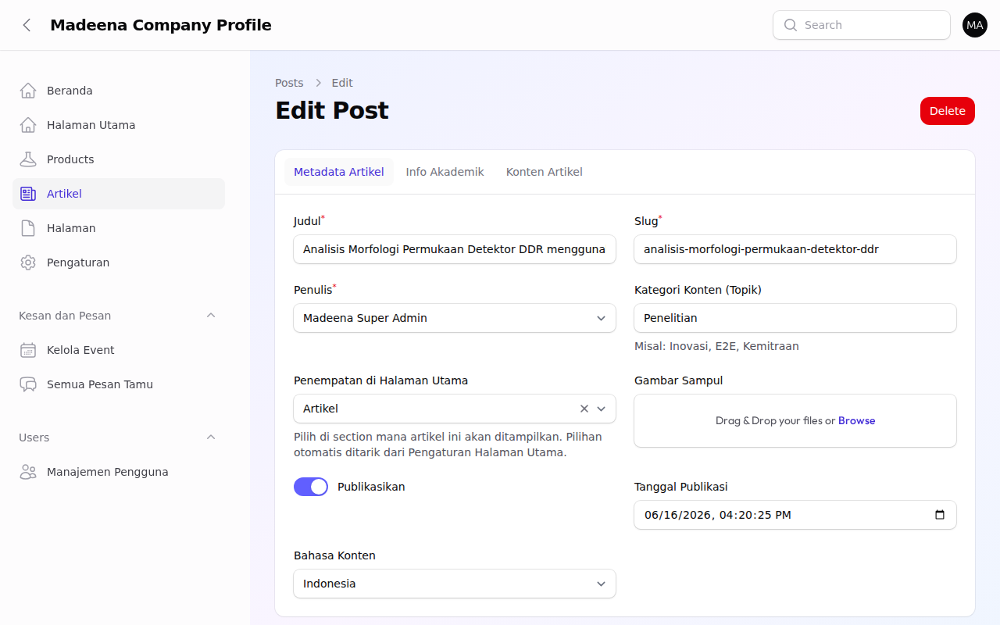
*Gambar 8: Formulir pembuatan artikel dengan tab "Metadata", "Info Akademik", dan "Konten Artikel".*

**Langkah 3**: Di *tab* **Metadata Artikel**, isi **Judul** (contoh: *Analisis Morfologi Permukaan Detektor DDR menggunakan SEM*).
**Langkah 4**: Aktifkan sakelar (*toggle*) **Publikasikan** jika artikel sudah siap dibaca publik.
**Langkah 5**: Di *tab* **Info Akademik**, Anda bisa memasukkan **Abstrak** dan nama-nama **Penulis Tambahan/Afiliasi** yang terlibat dalam penelitian tersebut.
**Langkah 6**: Klik *tab* **Konten Artikel** untuk mulai menulis isi penelitian.

### Menggunakan Editor Teks Akademik

Di dalam Konten Artikel, sistem akan secara otomatis menyimpan tulisan Anda setiap 3 detik.

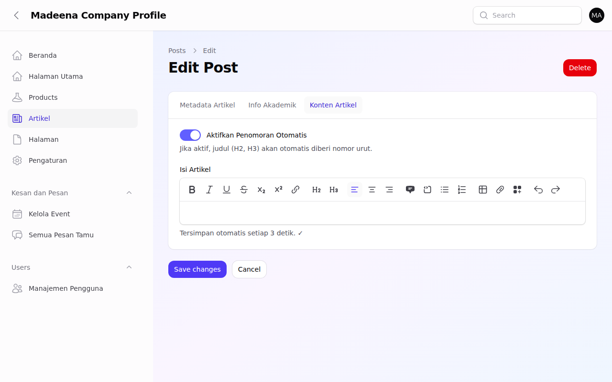
*Gambar 9: Tampilan Rich Editor. Perhatikan menu untuk memasukkan Persamaan (Equation) atau Tabel.*

**Memasukkan Persamaan Matematika/Fisika:**
Klik ikon kalkulator di bagian atas editor (*EquationBlock*). Akan muncul kolom untuk Anda mengetikkan format LaTeX.
Contoh: Ketikkan `E = mc^2` atau `\frac{\partial^2 u}{\partial t^2} = c^2 \nabla^2 u`.

---

## 7. Mengelola Halaman Website

Mirip dengan Halaman Utama, fitur 📄 **Halaman** digunakan untuk membuat halaman-halaman profil perusahaan yang berdiri sendiri.

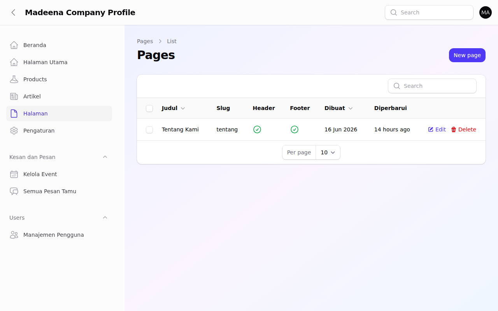
*Gambar 10: Daftar Halaman Kustom.*

Anda bisa mengatur apakah halaman ini ingin ditampilkan di **Navigasi Header** (menu bagian atas website) atau di **Footer** (menu bagian paling bawah website). Penyusunan kontennya menggunakan sistem "Blok" yang sama persis dengan Halaman Utama.

---

## 8. Manajemen Pengguna (Admin)

Menu 👥 **Manajemen Pengguna** digunakan untuk mengatur siapa saja yang boleh masuk ke dalam CMS ini.

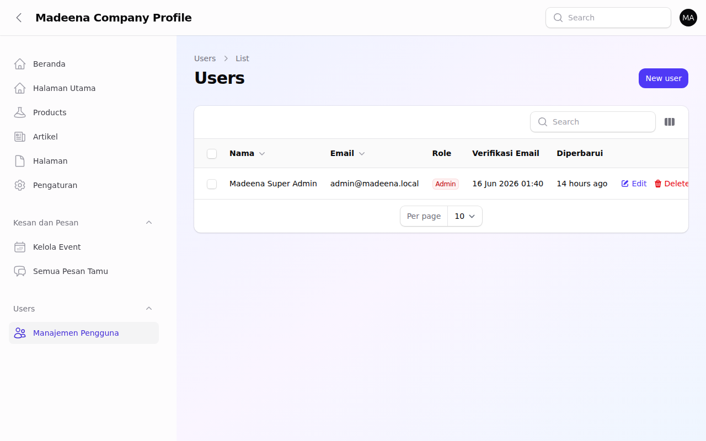
*Gambar 11: Daftar pengguna CMS.*

Anda bisa mengubah status (Role) seseorang menjadi **Admin** (memiliki akses penuh seperti Anda) atau **User** (akses terbatas).

---

## 9. Pengaturan Website

Menu ⚙️ **Pengaturan** mengatur tampilan keseluruhan dari website Anda.

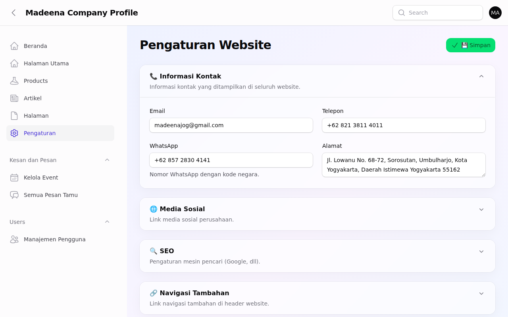
*Gambar 12: Halaman pengaturan kontak, SEO, dan estetika warna website.*

- **Informasi Kontak**: Untuk mengubah alamat, nomor telepon, dan email utama.
- **Media Sosial**: Untuk memperbarui tautan ke LinkedIn atau kanal YouTube Anda.
- **SEO**: Untuk mengubah apa yang akan tampil jika nama PT Madeena dicari di Google.
- **Pengaturan Tampilan**: Untuk mengganti Logo dan warna utama website.
- **Tombol WhatsApp Melayang**: Jika diaktifkan, akan muncul tombol WhatsApp di pojok layar website agar pengunjung bisa langsung mengirim pesan ke staf Anda.

---

## 10. Tanya Jawab & Pemecahan Masalah (FAQ)

**T: Mengapa perubahan yang saya buat di Halaman Utama belum muncul di website?**
J: Anda mungkin baru mengklik "Simpan Draft". Anda harus mengklik tombol hijau **Update Prod** (Update Production) agar perubahan diterapkan ke website publik.

**T: Bagaimana cara mengetik rumus matematika di Artikel?**
J: Pada *tab* Konten Artikel, klik tombol "Persamaan / Equation" di baris alat (*toolbar*), lalu masukkan rumus dalam format bahasa pemrograman *LaTeX*.

**T: Saya lupa kata sandi (password), apa yang harus dilakukan?**
J: CMS ini menggunakan SSO (Single Sign-On). Silakan gunakan fasilitas "Lupa Kata Sandi" di halaman utama login SSO Anda.

### 📞 Butuh Bantuan?

Jika Anda mengalami masalah yang tidak tercantum di atas, silakan hubungi:

- **Tim Teknis Madeena**: support@madeena.co.id
- **Jam Operasional**: Senin–Jumat, 08.00–17.00 WIB

> 💡 **Tips**: Saat menghubungi tim teknis, jelaskan langkah-langkah yang sudah Anda lakukan dan kirimkan tangkapan layar (*screenshot*) jika memungkinkan. Untuk mengambil tangkapan layar, tekan tombol **PrtSc** (Print Screen) di keyboard komputer Anda.
