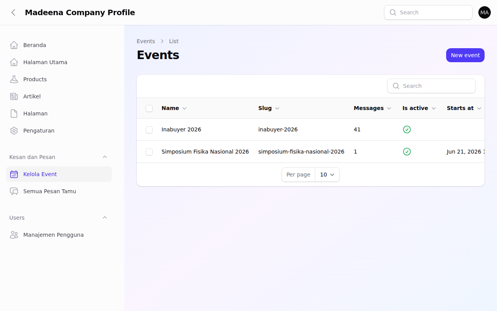
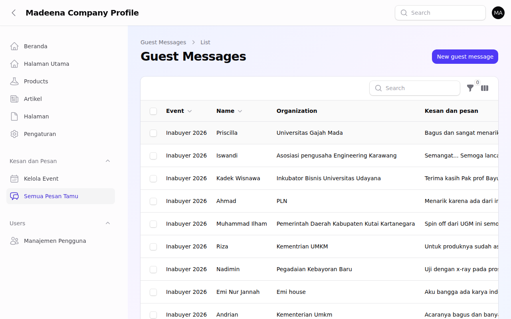

# 📖 Panduan Lengkap CMS Website Madeena

---

## 📋 Daftar Isi

1. Ringkasan Cepat (Cheat Sheet)
2. Masuk ke CMS (Login)
3. Mengenal Beranda (Dashboard)
4. Mengelola Halaman Utama Website (Homepage)
5. Mengelola Produk Inovasi
6. Menulis & Mengelola Artikel (Fitur Akademik)
7. Mengelola Halaman Website
8. Mengelola Acara (Event) & Pesan Tamu
9. Manajemen Pengguna (Admin)
10. Pengaturan Website
11. Tanya Jawab & Pemecahan Masalah (FAQ)

---

## 1. Ringkasan Cepat (Cheat Sheet)

| Saya ingin... | Langkah singkat |
|---|---|
| **Mengedit halaman depan** | Klik 🏠 **Halaman Utama** > Edit blok yang diinginkan > **Simpan Draft** > **Update Prod** |
| **Menambah produk baru** | Klik 📦 **Produk** > Klik **Buat Baru** > Isi data produk > **Simpan** |
| **Menulis artikel/berita** | Klik 📝 **Artikel** > Klik **Buat Baru** > Tulis di *Konten Artikel* > **Simpan** |
| **Membuat halaman profil/lain** | Klik 📄 **Halaman** > Klik **Buat Baru** > Susun blok halaman > **Simpan** |
| **Mengubah nomor WhatsApp/Alamat** | Klik ⚙️ **Pengaturan** > Ubah di bagian *Informasi Kontak* > **Simpan** |

---

## 2. Masuk ke CMS (Login)

CMS (*Content Management System*) adalah "ruang kontrol" website Anda. Dari sini Anda bisa mengubah isi website tanpa harus mengerti pemrograman.

**Langkah 1**: Buka *browser* (Google Chrome atau Mozilla Firefox) di komputer Anda.
**Langkah 2**: Ketikkan alamat website Anda di bagian atas, ditambahkan dengan `/admin` (contoh: `madeena.co.id/admin`).
**Langkah 3**: Masukkan email dan kata sandi (*password*) Anda, kemudian klik tombol **Masuk** (*Sign In*).

*Gambar 1: Tampilan awal halaman login untuk mengakses CMS.*

---

## 3. Mengenal Beranda (Dashboard)

Setelah berhasil masuk, Anda akan melihat **Beranda** (*Dashboard*). Ini adalah halaman utama panel admin.

*Gambar 2: Tampilan Beranda (Dashboard) CMS Madeena.*

### Menu Utama di Sebelah Kiri (*Sidebar*):

- 🏠 **Halaman Utama** → Untuk mengubah tampilan dan teks di halaman depan website.
- 📦 **Produk** → Untuk mengelola daftar produk DDR dan inovasi kesehatan lainnya.
- 📝 **Artikel** → Untuk mengelola jurnal, publikasi, berita, lengkap dengan editor akademik.
- 📄 **Halaman** → Untuk membuat halaman kustom (misal: halaman tentang sejarah spesifik).
- 📅 **Event** → Untuk manajemen acara dan pendaftaran buku tamu.
- ✉️ **Pesan Tamu** → Untuk melihat *feedback* dan ulasan pengunjung acara.
- ⚙️ **Pengaturan** → Untuk mengatur informasi kontak, media sosial, logo, dan SEO.
- 👥 **Manajemen Pengguna** → Untuk menambah atau menghapus admin lain.

Sekarang Anda sudah mengenal Beranda (*Dashboard*). Mari kita mulai dengan hal yang paling penting: **mengelola tampilan halaman utama website Anda**. Klik menu 🏠 **Halaman Utama** di sebelah kiri.

---

## 4. Mengelola Halaman Utama Website (Homepage)

Halaman utama adalah hal pertama yang dilihat oleh pengunjung website. Anda bisa mengubah urutan, teks, dan gambar pada halaman ini menggunakan sistem blok (seperti menyusun *Lego*).

**Langkah 1**: Klik menu 🏠 **Halaman Utama** di panel sebelah kiri.

*Gambar 3: Daftar "blok" yang menyusun halaman utama website.*

**Langkah 2**: Untuk mengedit suatu bagian (misal: *Hero Banner* atau *Produk*), klik tanda panah ke bawah (🔽) di sebelah kanan baris tersebut untuk membukanya.

*Gambar 4: Tampilan detail setelah suatu blok dibuka. Anda bisa mengubah teks dan gambar di sini.*

**Langkah 3**: Ubah teks atau unggah gambar yang baru.
**Langkah 4**: Klik tombol **👁️ Pratinjau** di pojok kanan atas untuk melihat bagaimana hasilnya sebelum ditampilkan ke publik.
**Langkah 5**: Jika sudah sesuai, klik tombol kuning **💾 Simpan Draft** (disimpan untuk diedit nanti) atau tombol hijau **🚀 Update Prod** untuk langsung menerapkannya di website yang bisa diakses publik.

> ⚠️ **Perhatian**: Jangan lupa klik **Update Prod** jika Anda ingin perubahan tersebut langsung bisa dilihat oleh semua pengunjung website!

---

## 5. Mengelola Produk Inovasi

Menu ini digunakan untuk menampilkan produk-produk seperti sistem *Digital Direct Radiography* (DDR).

**Langkah 1**: Klik menu 📦 **Produk** di sebelah kiri. Anda akan melihat daftar semua produk.

*Gambar 5: Daftar produk yang sudah Anda masukkan.*

**Langkah 2**: Untuk menambah produk baru, klik tombol **Buat Baru** (*Create*) di pojok kanan atas. Untuk mengedit produk yang sudah ada, klik ikon pensil (✏️).

*Gambar 6: Formulir pengisian data produk.*

**Langkah 3**: Isi **Nama Produk** (contoh: *DDR Pro Series*).
**Langkah 4**: Isi **Spesifikasi**. Ini adalah tabel. Anda bisa menambah baris baru untuk resolusi, tegangan operasi, dll.
**Langkah 5**: Unggah **Gambar Produk** dengan mengklik area yang disediakan.
**Langkah 6**: Pindah ke *tab* (tab menu di bagian atas) **Halaman Detail Produk** untuk menyusun informasi detail menggunakan sistem blok.
**Langkah 7**: Klik tombol **Simpan** (*Save*) di bagian bawah.

---

## 6. Menulis & Mengelola Artikel (Fitur Akademik)

Menu ini sangat berguna untuk memublikasikan penelitian, jurnal, atau pengumuman resmi.

**Langkah 1**: Klik menu 📝 **Artikel** di panel sebelah kiri.

*Gambar 7: Daftar artikel dan penelitian yang telah dibuat.*

**Langkah 2**: Klik **Buat Baru** (*Create*).

*Gambar 8: Formulir pembuatan artikel dengan tab "Metadata", "Info Akademik", dan "Konten Artikel".*

**Langkah 3**: Di *tab* **Metadata Artikel**, isi **Judul** dan centang **Publikasikan** jika sudah siap dibaca publik.
**Langkah 4**: Di *tab* **Info Akademik**, Anda bisa memasukkan **Abstrak** dan nama-nama **Penulis Tambahan/Afiliasi**.
**Langkah 5**: Klik *tab* **Konten Artikel** untuk mulai menulis isi penelitian.

### Menggunakan Editor Teks Akademik (Rich Editor)

Sistem CMS ini didesain khusus untuk mendukung penulisan karya tulis ilmiah. Di dalam Konten Artikel, sistem akan secara otomatis menyimpan tulisan Anda setiap 3 detik.

*Gambar 9: Tampilan Rich Editor. Perhatikan menu tambahan untuk memasukkan Daftar Pustaka, Persamaan (Equation), Gambar Akademik, dan Tabel.*

Di dalam editor ini, Anda bisa menyisipkan "Blok-blok" khusus akademik. Berikut adalah penjelasan untuk masing-masing blok:

#### A. Daftar Pustaka (References) & Sitasi dalam Paragraf
Anda bisa menyisipkan daftar pustaka di bagian bawah artikel dan merujuknya (sitasi) di tengah-tengah paragraf tulisan Anda.
1. Klik tanda **+ (Tambah Blok)** di dalam area penulisan, lalu pilih **Daftar Pustaka / References**.
2. Masukkan judul jurnal, nama penulis, dll. Sistem akan otomatis memberikan nomor referensi, contoh: **[1]**.
3. **Untuk Melakukan Sitasi:** Saat Anda mengetik paragraf biasa, ketikkan `[@1]` (atau `[@2]`, dst) tepat di posisi Anda ingin mengutip.
   *Contoh pengetikan*: `"Berdasarkan pengembangan detektor DDR sebelumnya [@1], dapat disimpulkan bahwa..."*
   *Hasil di website*: CMS akan secara otomatis mengubah tulisan `[@1]` tersebut menjadi angka rujukan kecil (superscript) yang jika diklik akan melompat langsung ke Daftar Pustaka nomor 1.

#### B. Blok Persamaan Matematika (Equation)
Klik ikon kalkulator di baris alat (atau pilih blok *Equation*). Akan muncul kolom untuk Anda mengetikkan rumus dalam format *LaTeX*.
*Contoh*: Ketikkan `E = mc^2` atau `\frac{\partial^2 u}{\partial t^2} = c^2 \nabla^2 u`.
> Jangan lupa isi kolom **ID Referensi** dengan format berurut (contoh: `eq-1`, `eq-2`) agar persamaan ini diberi nomor otomatis di website, seperti "Persamaan (1)".
> **Cara Melakukan Sitasi:** Untuk merujuk ke persamaan ini di dalam teks paragraf, gunakan sintaks `[@Persamaan 1]` atau `[@Eq 1]`. Sistem akan otomatis membuatkannya tautan klik.

#### C. Blok Gambar (Figure) Akademik
Klik ikon Gambar/Foto. Berbeda dengan gambar biasa, blok ini meminta Anda untuk:
- Mengunggah gambar/ilustrasi.
- Mengisi **Caption** (Keterangan Gambar).
- Mengisi **ID Referensi** berurut (contoh: `fig-1`, `fig-2`). 
Hasilnya di website akan tampil rapi dan berurutan secara otomatis, misal: **Gambar 1: Ilustrasi SEM pada detektor**.
> **Cara Melakukan Sitasi:** Di dalam teks paragraf, Anda bisa merujuk ke gambar ini dengan mengetikkan `[@Gambar 1]` atau `[@Fig 1]`.

#### D. Blok Tabel (Table) Akademik
Klik ikon Tabel, lalu masukkan tabel dalam format standar HTML. Jika Anda memberikan **ID Referensi** (contoh: `tbl-1`, `tbl-2`), CMS akan menampilkan keterangannya sebagai **Tabel 1: Hasil Pengukuran Suhu** dan seterusnya secara berurutan.
> **Cara Melakukan Sitasi:** Untuk menyebut tabel ini di dalam tulisan Anda, ketikkan `[@Tabel 1]` atau `[@Table 1]`.

> 💡 **Tips Penomoran Otomatis**: Pastikan Anda mengaktifkan sakelar hijau **"Aktifkan Penomoran Otomatis"** yang berada di atas area penulisan agar CMS mengurus urutan seluruh nomor (Bab H2, Gambar, Tabel, Persamaan) secara otomatis!

---

## 7. Mengelola Halaman Website

Mirip dengan Halaman Utama, fitur 📄 **Halaman** digunakan untuk membuat halaman-halaman profil perusahaan yang berdiri sendiri (contoh: Sejarah Perusahaan, Visi & Misi).

*Gambar 10: Daftar Halaman Kustom.*

Anda bisa mengatur apakah halaman ini ingin ditampilkan di **Navigasi Header** (menu bagian atas website) atau di **Footer** (menu bagian paling bawah website). Penyusunan kontennya menggunakan sistem "Blok" yang sama persis dengan Halaman Utama.

---

## 8. Mengelola Acara (Event) & Pesan Tamu

Website Anda dilengkapi fitur untuk mendata acara yang diselenggarakan oleh PT Madeena, sekaligus menyediakan buku tamu digital untuk menghimpun kesan dan pesan (feedback) dari kolega.

### Mengelola Event (Acara)

**Langkah 1**: Klik menu 📅 **Event** di panel sebelah kiri.

*Gambar 11: Daftar Acara/Event.*

**Langkah 2**: Klik **Buat Baru**.
**Langkah 3**: Isi Nama Acara (misal: *Simposium Fisika Nasional 2026*), Deskripsi, serta Tanggal Mulai dan Selesai.
**Langkah 4**: Simpan. Setelah disimpan, sistem akan secara otomatis mengaktifkan tautan Buku Tamu khusus untuk acara tersebut.

### Mengecek Pesan Tamu (Guest Messages)

Ketika tamu atau kolega menghadiri acara dan mengisi formulir kesan dan pesan secara *online*, datanya akan otomatis masuk ke menu **Pesan Tamu**.

*Gambar 12: Daftar Pesan Tamu yang masuk beserta detail instansi, jabatan, dan nomor kontak.*

Anda bisa mengklik tombol Edit (✏️) pada pesan tertentu untuk melihat pesan selengkapnya. Di sana, Anda bisa mengatur apakah pesan tamu ini hanya untuk dibaca internal (**is_visible = mati**), atau Anda ingin menampilkannya di halaman testimoni publik (**is_visible = nyala**).

---

## 9. Manajemen Pengguna (Admin)

Menu 👥 **Manajemen Pengguna** digunakan untuk mengatur siapa saja yang boleh masuk ke dalam CMS ini.

*Gambar 13: Daftar pengguna CMS.*

Anda bisa mengubah status (Role) seseorang menjadi **Admin** (memiliki akses penuh seperti Anda) atau **User** (akses terbatas, misalnya hanya boleh menulis Artikel).

---

## 10. Pengaturan Website

Menu ⚙️ **Pengaturan** mengatur tampilan keseluruhan dari website Anda.

*Gambar 14: Halaman pengaturan kontak, SEO, dan estetika warna website.*

- **Informasi Kontak**: Untuk mengubah alamat kantor, nomor telepon, dan email utama.
- **Media Sosial**: Untuk memperbarui tautan ke LinkedIn atau kanal YouTube riset Anda.
- **SEO**: Untuk mengubah apa yang akan tampil jika nama PT Madeena dicari di Google.
- **Pengaturan Tampilan**: Untuk mengganti Logo perusahaan dan tema warna utama website.
- **Tombol WhatsApp Melayang**: Jika diaktifkan, akan muncul ikon WhatsApp di pojok layar website agar instansi/pembeli bisa langsung mengirim pesan ke staf teknis Anda.

---

## 11. Tanya Jawab & Pemecahan Masalah (FAQ)

**T: Mengapa perubahan yang saya buat di Halaman Utama belum muncul di website?**
J: Anda mungkin baru mengklik "Simpan Draft". Anda harus mengklik tombol hijau **Update Prod** (Update Production) agar perubahan diterapkan ke website publik.

**T: Bagaimana cara memastikan sitasi [1] nyambung ke daftar referensi?**
J: Pastikan Anda menambahkan blok "Daftar Pustaka / References" di editor, dan ketik format persis `[@1]`, `[@2]`, dst. di dalam paragraf. Penomoran akan mengikuti urutan Anda di blok daftar pustaka.

**T: Saya lupa kata sandi (password), apa yang harus dilakukan?**
J: CMS ini telah terintegrasi dengan jaringan SSO *madeena-iam*. Silakan klik "Lupa Kata Sandi" di halaman utama *Single Sign-On* Anda.

### 📞 Butuh Bantuan?

Jika Anda mengalami masalah yang tidak tercantum di atas, silakan hubungi:

- **Tim Teknis Madeena**: support@madeena.co.id
- **Jam Operasional**: Senin–Jumat, 08.00–17.00 WIB

> 💡 **Tips**: Saat menghubungi tim teknis, jelaskan langkah-langkah yang sudah Anda lakukan dan kirimkan tangkapan layar (*screenshot*) jika memungkinkan. Untuk mengambil tangkapan layar, tekan tombol **PrtSc** (Print Screen) di keyboard komputer Anda.
